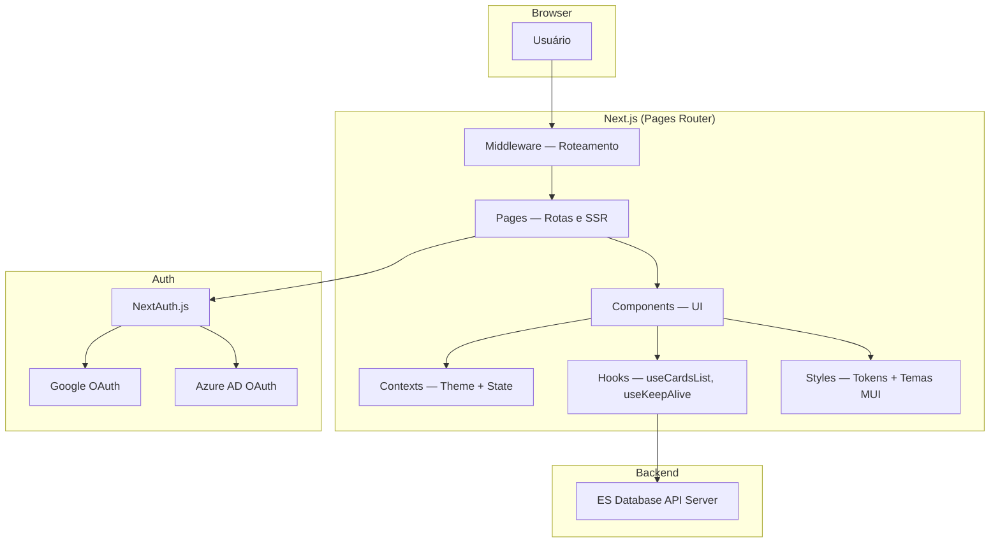

<div align="center">

# ES Database V2

[](https://github.com/ESousa97/esdatabasev2/actions/workflows/ci.yml)
[](https://www.codefactor.io/repository/github/esousa97/esdatabasev2)
[](https://opensource.org/licenses/MIT)
[](#)

**Frontend do ecossistema ES Data Base — interface moderna em Next.js (Pages Router) para visualização e gestão de conhecimento técnico com múltiplos modos de listagem (cards, lista compacta, lista detalhada), autenticação OAuth via NextAuth (Google + Azure AD), design system com tokens centralizados, tema claro/escuro automático, páginas de erro animadas com Lottie, busca integrada via API e pipeline CI com lint, build, testes e security audit.**

</div>

---

> **⚠️ Projeto Arquivado**
> Este projeto não recebe mais atualizações ou correções. O código permanece disponível como referência e pode ser utilizado livremente sob a licença MIT. Fique à vontade para fazer fork caso deseje continuar o desenvolvimento.

---

## Índice

- [Sobre o Projeto](#sobre-o-projeto)
- [Funcionalidades](#funcionalidades)
- [Tecnologias](#tecnologias)
- [Arquitetura](#arquitetura)
- [Estrutura do Projeto](#estrutura-do-projeto)
- [Começando](#começando)
  - [Pré-requisitos](#pré-requisitos)
  - [Instalação](#instalação)
  - [Configuração](#configuração)
  - [Uso Local](#uso-local)
- [Scripts Disponíveis](#scripts-disponíveis)
- [Qualidade e Governança](#qualidade-e-governança)
- [Documentação Estendida](#documentação-estendida)
- [FAQ](#faq)
- [Licença](#licença)
- [Contato](#contato)

---

## Sobre o Projeto

Frontend do ecossistema **ES Data Base**, integrado ao [ES Database API Server](https://github.com/ESousa97/serverdatabase). A aplicação permite visualizar e gerenciar projetos e procedimentos técnicos com interface responsiva, autenticação OAuth, múltiplos modos de listagem e um design system completo com tokens centralizados.

O repositório prioriza:

- **Múltiplos modos de visualização** — Cards, lista detalhada e lista compacta com seleção automática por largura de tela ou manual via toolbar, persistidos em cookies
- **Autenticação OAuth** — NextAuth.js com provedores Google e Azure AD, allowlist de emails via `ALLOWED_EMAILS`, sessão com timeout de 4h por inatividade e logout automático
- **Design System** — Tokens centralizados em `src/styles/tokens.js` (paleta, tipografia, spacing, breakpoints, shadows, z-index), temas light/dark via MUI `createTheme`, toggle automático por `prefers-color-scheme` e manual via contexto
- **Páginas de erro animadas** — Componentes dedicados para 400, 401, 403, 404, 500, 503 com animações Lottie, `ErrorBoundary` global e `ErrorGateway` para roteamento de erros
- **Integração API** — Axios client centralizado (`apiClient`) com base URL configurável, busca em tempo real via `/search`, error handler com redirect automático para páginas de erro
- **Keep-alive** — Hook `useKeepAlive` que pinga o backend a cada 45s para manter servidores Render ativos

---

## Funcionalidades

- **Visualização de projetos** — Cards com imagem e descrição, lista detalhada com avatar e data, lista compacta com título e resumo
- **Ordenação** — Por data de criação, data de atualização e ordem alfabética, com direção ascendente/descendente, persistida em cookies
- **Busca em tempo real** — Autocomplete integrado que pesquisa projetos via endpoint `/search` da API
- **Sidebar de categorias** — Drawer com categorias agrupadas carregadas da API, navegação para procedimentos individuais
- **Procedimentos** — Páginas de detalhe com renderização de Markdown (marked + DOMPurify), syntax highlighting (highlight.js), botões de cópia, embed de YouTube com lazy loading e modo expandido
- **Autenticação** — Login com Google e Azure AD via NextAuth, middleware de roteamento que redireciona para `/components`, fake-login pages com animações e easter eggs
- **Tema claro/escuro** — Toggle via AppBar + detecção automática de preferência do sistema, script inline em `_document.js` para evitar flash
- **Páginas de erro** — 400, 401, 403, 404, 500, 503 com animações Lottie e transições Framer Motion, `ErrorGateway` para dispatch, `ErrorBoundary` global como fallback
- **Responsividade** — Breakpoints em 330px, 400px, 600px e 900px com ajustes de tamanho, padding e visibilidade em cada componente

---

## Tecnologias

### Core


### Autenticação e API


### UI e Animação


### Ferramentas de Desenvolvimento


**Dependências principais:** next 16.1, react 19.2, @mui/material 7.3, next-auth 4.24, axios 1.6, framer-motion 11.18, lottie-react 2.4, marked 15, highlight.js 11, date-fns 3.

---

## Arquitetura



### Camadas Principais

| Camada         | Responsabilidade                                                                                     |
| -------------- | ---------------------------------------------------------------------------------------------------- |
| **Pages**      | Rotas Next.js (components, procedimentos/[id], login, erro, páginas de status HTTP)                  |
| **Middleware** | Roteamento: redireciona para `/components`, permite `/login`, `/api`, `/procedimentos`               |
| **Components** | Layout (AppBar, Drawer, MainLayout), Listas (Card, Compact, Detailed), Procedures, Auth, Error pages |
| **Contexts**   | `CustomThemeProvider` — toggle dark/light com detecção automática de preferência                     |
| **Hooks**      | `useCardsList` (fetch + sort), `useKeepAlive` (ping backend 45s)                                     |
| **Styles**     | Tokens (paleta, tipografia, spacing, shadows, breakpoints), temas MUI, SCSS global                   |
| **Utils**      | `apiClient` (Axios), `apiErrorHandler` (redirect), `helpers` (formatDate, truncate, debounce, cn)    |

---

## Estrutura do Projeto

```
esdatabasev2/
├── pages/
│   ├── api/
│   │   └── auth/
│   │       └── [...nextauth].js       # Config NextAuth (Google + Azure AD)
│   ├── procedimentos/
│   │   └── [id].js                    # Página de procedimento dinâmica
│   ├── fake-login/
│   │   └── [type].js                  # Fake login com animações e easter eggs
│   ├── _app.js                        # Provider global (Theme + ErrorBoundary + KeepAlive)
│   ├── _document.js                   # HTML base com script de tema inline
│   ├── _error.js                      # Error page genérica com ErrorGateway
│   ├── index.js                       # Home (redirect para /components)
│   ├── components.js                  # Página principal com toolbar e ListView
│   ├── login.js                       # Login com provedores OAuth
│   ├── erro.js                        # Erro genérico com código via query param
│   ├── 400.js                         # Bad Request
│   ├── 401.js                         # Unauthorized
│   ├── 403.js                         # Forbidden
│   ├── 404.js                         # Not Found
│   ├── 500.js                         # Internal Server Error
│   └── 503.js                         # Service Unavailable
├── middleware.js                       # Roteamento (redireciona para /components)
├── src/
│   ├── components/
│   │   ├── Auth/                      # GoogleIcon, MicrosoftIcon, LoginForm
│   │   ├── Common/
│   │   │   ├── ErrorBoundary.js       # Error boundary global (class component)
│   │   │   ├── ErrorGateway.js        # Switch de erro por status code
│   │   │   ├── StatusErrorPage.js     # Template para páginas de erro com Lottie
│   │   │   ├── GenericError.js        # Fallback para erros desconhecidos
│   │   │   ├── SearchBox/             # Autocomplete com busca via API
│   │   │   ├── CategoryIconMapper.js  # Mapeamento de categorias para ícones
│   │   │   ├── Modal.js               # Dialog reutilizável (MUI Dialog)
│   │   │   └── LoadingState.js        # Spinners e containers de loading
│   │   ├── Layout/
│   │   │   ├── AppBar.js              # Barra fixa com busca, tema, menu e logout
│   │   │   ├── Drawer.js              # Sidebar com categorias da API
│   │   │   └── MainLayout.js          # Layout wrapper com AppBar + Drawer + Modal
│   │   ├── Lists/
│   │   │   ├── CardList/              # Grid de cards com imagem e descrição
│   │   │   ├── CompactList/           # Lista compacta com avatar e texto
│   │   │   ├── DetailedList/          # Lista detalhada com data de criação
│   │   │   └── ListView/              # Switch entre os três modos
│   │   ├── Procedures/
│   │   │   ├── ProcedurePages.js      # Fetch e render de procedimento por ID
│   │   │   ├── ProcedureDetails.js    # Markdown render + YouTube embed + copy buttons
│   │   │   └── ProcedureDetailsStyles.js  # Styled components do detalhe
│   │   ├── StyleLink/                 # Link animado com underline progressivo
│   │   └── pages/
│   │       └── ComponentsPageStyled.js  # Styled components da página principal
│   ├── contexts/
│   │   └── ThemeProvider.js           # Toggle dark/light + auto-detect
│   ├── hooks/
│   │   ├── useCardsList.js            # Fetch de cards + sort
│   │   └── useKeepAlive.js            # Ping backend a cada 45s
│   ├── styles/
│   │   ├── tokens.js                  # Design tokens centralizados
│   │   ├── theme.js                   # Temas MUI (light + dark)
│   │   ├── variables.js               # Re-export legacy para compatibilidade
│   │   ├── global.scss                # Reset CSS, scrollbar, acessibilidade, print
│   │   └── layout/
│   │       └── _layoutStyles.js       # AppBar styled component
│   ├── utils/
│   │   ├── apiClient.js               # Axios instance (baseURL, timeout 15s)
│   │   ├── apiErrorHandler.js         # handleApiError + isNetworkError + isAuthError
│   │   ├── helpers.js                 # formatDate, truncateText, debounce, throttle, cn
│   │   └── index.js                   # Re-exports centralizados
│   └── animations/                    # Arquivos Lottie JSON para páginas de erro
├── __tests__/
│   ├── components/
│   │   └── ErrorBoundary.test.jsx     # Testes do ErrorBoundary
│   └── utils/
│       └── apiErrorHandler.test.js    # Testes do error handler
├── docs/
│   ├── architecture.md                # Visão arquitetural
│   ├── environment.md                 # Variáveis de ambiente
│   └── development.md                 # Guia de desenvolvimento
├── .github/
│   ├── workflows/
│   │   └── ci.yml                     # Lint → Build → Test → Security Audit
│   ├── ISSUE_TEMPLATE/
│   ├── PULL_REQUEST_TEMPLATE.md
│   └── dependabot.yml
├── .husky/
│   └── pre-commit                     # lint-staged
├── package.json                       # v2.0.0, Node >=18
├── next.config.js                     # reactStrictMode: true
├── jest.config.js                     # next/jest + jsdom + module aliases
├── jest.setup.js                      # Mock router, next-auth, matchMedia
├── eslint.config.mjs                  # Flat config (React, Hooks, A11y, Next.js, Prettier)
├── .prettierrc                        # Semi, single quote, trailing comma
├── .editorconfig                      # UTF-8, LF, indent 2
├── .env.example                       # Template de variáveis de ambiente
├── CHANGELOG.md                       # Keep a Changelog format
├── CONTRIBUTING.md                    # Guia de contribuição
├── CODE_OF_CONDUCT.md                 # Contributor Covenant 2.1
├── SECURITY.md                        # Política de segurança
└── LICENSE                            # MIT
```

---

## Começando

### Pré-requisitos

```bash
node --version  # v18 ou superior
npm --version   # v9 ou superior
```

### Instalação

1. **Clone o repositório**

```bash
git clone https://github.com/ESousa97/esdatabasev2.git
cd esdatabasev2
```

2. **Instale as dependências**

```bash
npm install
```

> O projeto usa `legacy-peer-deps=true` via `.npmrc` para compatibilidade de dependências.

3. **Configure o ambiente**

```bash
cp .env.example .env.local
# Edite .env.local com suas credenciais
```

### Configuração

Variáveis de ambiente essenciais (`.env.local`):

```env
# NextAuth
NEXTAUTH_SECRET=your-nextauth-secret
NEXTAUTH_URL=http://localhost:3000

# Google OAuth (https://console.cloud.google.com/)
GOOGLE_CLIENT_ID=your-google-client-id
GOOGLE_CLIENT_SECRET=your-google-client-secret

# Azure AD OAuth (Azure Portal > App Registrations)
AZURE_AD_CLIENT_ID=your-azure-client-id
AZURE_AD_CLIENT_SECRET=your-azure-client-secret
AZURE_AD_TENANT_ID=your-azure-tenant-id

# Access Control — emails permitidos (separados por vírgula)
ALLOWED_EMAILS=user1@example.com,user2@example.com

# API Backend
NEXT_PUBLIC_API_URL=https://serverdatabase.onrender.com/api/v1
```

Consulte [`.env.example`](.env.example) para a lista completa. Para mais detalhes, veja [docs/environment.md](docs/environment.md).

### Uso Local

```bash
npm run dev
```

Acesse: `http://localhost:3000`

---

## Scripts Disponíveis

```bash
# Servidor de desenvolvimento (Next.js)
npm run dev

# Build de produção
npm run build

# Servidor de produção
npm run start

# Lint (ESLint com React, Hooks, A11y, Next.js)
npm run lint

# Lint com correção automática
npm run lint:fix

# Formatação (Prettier)
npm run format

# Verificar formatação sem alterar
npm run format:check

# Testes (Jest + Testing Library)
npm test

# Testes em modo watch
npm run test:watch

# Testes com cobertura
npm run test:coverage

# Limpar cache (.next, out, node_modules/.cache)
npm run clean
```

---

## Qualidade e Governança

O projeto adota práticas de governança para manter a qualidade do código:

- **CI** — Pipeline de 4 jobs: Lint → Build → Test → Security Audit via GitHub Actions com concurrency control (cancela runs anteriores)
- **Testes** — Jest + Testing Library (jsdom) com mocks de Next.js router, NextAuth e matchMedia; cobertura mínima de 50% (branches, functions, lines, statements)
- **Linting** — ESLint flat config com plugins React, React Hooks, JSX A11y, Next.js e Prettier; `eslint-config-prettier` para evitar conflitos
- **Git hooks** — Husky com lint-staged (pre-commit): ESLint + Prettier em `.js/.jsx`, Prettier em `.json/.md/.yml`
- **Dependabot** — Atualizações semanais de npm (minor/patch agrupadas, major separadas) e GitHub Actions
- **Governança** — Issue/PR templates, CONTRIBUTING.md, CODE_OF_CONDUCT.md, SECURITY.md

> Para diretrizes de contribuição, consulte [`CONTRIBUTING.md`](CONTRIBUTING.md). Para política de segurança, consulte [`SECURITY.md`](SECURITY.md).

---

## Documentação Estendida

| Documento                            | Descrição                                                                 |
| ------------------------------------ | ------------------------------------------------------------------------- |
| [Architecture](docs/architecture.md) | Visão arquitetural, fluxo de autenticação, design system e integração API |
| [Environment](docs/environment.md)   | Variáveis de ambiente com descrições e notas                              |
| [Development](docs/development.md)   | Setup local, linting, testes, build e git hooks                           |

---

## FAQ

<details>
<summary><strong>Qual a relação entre ES Database V2 e ES Database API?</strong></summary>

O ES Database V2 é o frontend (Next.js) e o [ES Database API](https://github.com/ESousa97/serverdatabase) é o backend (Express + Sequelize). O frontend consome a API via Axios (`NEXT_PUBLIC_API_URL`) para projetos, cards, categorias, busca e upload de imagens. São repositórios independentes que podem ser deployados separadamente.

</details>

<details>
<summary><strong>Como funciona a autenticação?</strong></summary>

NextAuth.js gerencia OAuth com Google e Azure AD. O callback `signIn` valida emails contra `ALLOWED_EMAILS` (env). Se a lista estiver vazia em dev, todos os emails são permitidos. A sessão expira por inatividade após 4 horas, exibindo um diálogo de relogin. O middleware redireciona rotas não autorizadas para `/components`.

</details>

<details>
<summary><strong>Por que existem "fake login" pages?</strong></summary>

As páginas em `pages/fake-login/[type].js` são easter eggs humorísticos — exibem animações Lottie e mensagens engraçadas quando o usuário tenta logar, com countdown, confetti, som e redirect automático para `/components`. Incluem também um snackbar escondido que aparece se o usuário pausar o countdown por 7 segundos.

</details>

<details>
<summary><strong>Como funciona o hook useKeepAlive?</strong></summary>

O `useKeepAlive` envia um `GET /api/v1/ping` ao backend a cada 45 segundos para manter servidores free-tier (como Render) ativos. Pode ser desabilitado via `NEXT_PUBLIC_KEEP_ALIVE=false`. É inicializado no `_app.js` e roda em todas as páginas.

</details>

---

## Licença

Este projeto está sob a licença MIT. Veja o arquivo [LICENSE](LICENSE) para mais detalhes.

```
MIT License - você pode usar, copiar, modificar e distribuir este código.
```

---

## Contato

**José Enoque Costa de Sousa**

[](https://www.linkedin.com/in/enoque-sousa-bb89aa168/)
[](https://github.com/ESousa97)
[](https://enoquesousa.vercel.app)

---

<div align="center">

**[⬆ Voltar ao topo](#es-database-v2)**

Feito com ❤️ por [José Enoque](https://github.com/ESousa97)

**Status do Projeto:** Archived — Sem novas atualizações

</div>
