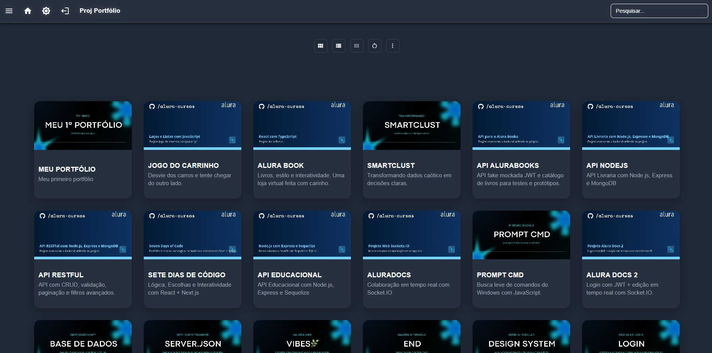
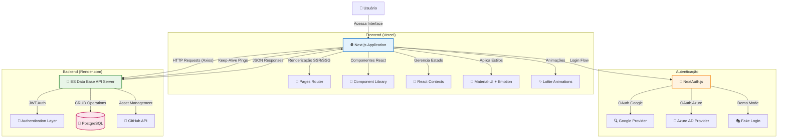

# ES Database V2 / Projects Portfolio - Frontend

**Slogan Filosófico:** *Interface elegante e intuitiva para visualização e gerenciamento de conhecimento técnico, integrando-se perfeitamente com o ES Data Base API Server.*

## Abstract (Resumo Técnico)

O ES Database V2 / Projects Portfolio Frontend é a interface de usuário moderna e responsiva do ecossistema ES Data Base, projetada para consumir e apresentar dados do [ES Data Base API Server](https://github.com/ESousa97/serverdatabase-main). Construída sobre Next.js e Material-UI, esta aplicação oferece uma experiência de usuário rica e interativa para visualização, busca e exploração de projetos e procedimentos técnicos. A arquitetura componentizada em React permite múltiplos modos de visualização (cards, lista detalhada, lista compacta), busca dinâmica em tempo real, e renderização avançada de conteúdo Markdown com syntax highlighting. O sistema integra autenticação via NextAuth.js com provedores Google e Azure AD, incluindo um modo de demonstração "fake login" para exploração sem credenciais. A plataforma destaca-se pela experiência do usuário aprimorada através de animações Lottie, páginas de erro customizadas, alternância de temas dark/light, e integração inteligente com o backend via hooks personalizados para manter a conectividade ativa. O resultado é uma interface web moderna, performática e acessível que serve como portal principal para o ecossistema de gerenciamento de conhecimento técnico.

## Badges Abrangentes


## Sumário (Table of Contents)

*   [Introdução e Motivação](#introdução-e-motivação)
*   [🔗 Link Principal / Acesso ao Projeto](#-link-principal--acesso-ao-projeto)
*   [Arquitetura do Sistema](#arquitetura-do-sistema)
*   [Decisões de Design Chave](#decisões-de-design-chave)
*   [✨ Funcionalidades Detalhadas](#-funcionalidades-detalhadas-com-casos-de-uso)
*   [🛠️ Tech Stack Detalhado](#️-tech-stack-detalhado)
*   [📂 Estrutura Detalhada do Código-Fonte](#-estrutura-detalhada-do-código-fonte)
*   [📋 Pré-requisitos Avançados](#-pré-requisitos-avançados)
*   [🚀 Guia de Instalação e Configuração](#-guia-de-instalação-e-configuração-avançada)
*   [⚙️ Uso Avançado e Exemplos](#️-uso-avançado-e-exemplos)
*   [🔧 Integração com Backend API](#-integração-com-backend-api)
*   [🧪 Estratégia de Testes e Qualidade de Código](#-estratégia-de-testes-e-qualidade-de-código)
*   [🚢 Deployment Detalhado e Escalabilidade](#-deployment-detalhado-e-escalabilidade)
*   [📜 Licença e Aspectos Legais](#-licença-e-aspectos-legais)
*   [❓ FAQ (Perguntas Frequentes)](#-faq-perguntas-frequentes)
*   [📞 Contato e Suporte](#-contato-e-suporte)

## Introdução e Motivação

O ES Database V2 Frontend representa a evolução natural da necessidade de uma interface moderna para o gerenciamento e visualização de conhecimento técnico. Como parte integrante do ecossistema ES Data Base, este frontend foi desenvolvido para complementar perfeitamente o [ES Data Base API Server](https://github.com/ESousa97/serverdatabase-main), oferecendo uma experiência de usuário superior na apresentação de projetos e procedimentos técnicos.

A motivação central reside em transformar dados complexos em experiências visuais intuitivas. Enquanto o backend ES Data Base fornece uma API robusta com autenticação JWT, gerenciamento de dados relacionais e integração GitHub para assets, o frontend foca exclusivamente na apresentação elegante desses dados, oferecendo múltiplas formas de visualização, busca avançada e navegação contextual.

O projeto aborda os desafios comuns de interfaces técnicas: como apresentar informações densas de forma acessível, como manter a performance com grandes volumes de dados, e como criar uma experiência coesa que incentive a exploração e o aprendizado. A solução combina tecnologias modernas do React/Next.js com um design system consistente (Material-UI) e funcionalidades avançadas como renderização de Markdown, syntax highlighting e integração de mídia.

## 📸 Prévia do Projeto



*Interface principal do ES Database V2 mostrando a visualização em cards, busca dinâmica e menu lateral de categorias*

> **Nota:** O sistema opera em modo de demonstração com "fake login" para facilitar a exploração, mantendo a infraestrutura completa de autenticação NextAuth.js para uso em produção.

## Arquitetura do Sistema

O ES Database V2 Frontend adota uma arquitetura cliente-servidor desacoplada, integrando-se perfeitamente com o ES Data Base API Server através de uma comunicação RESTful bem definida.



**Fluxo de Dados Principal:**
1. **Autenticação:** O usuário acessa via NextAuth.js (real ou simulado)
2. **Requisições:** O frontend faz chamadas HTTP para `https://serverdatabase.onrender.com/api/v1/`
3. **Processamento:** O backend ES Data Base processa via JWT, ORM Sequelize e integração GitHub
4. **Resposta:** Dados são retornados em JSON e renderizados dinamicamente na UI
5. **Manutenção:** Hook `useKeepAlive` mantém a conexão ativa com pings periódicos

## Decisões de Design Chave

1. **Integração Desacoplada com ES Data Base API Server:**
   - **Justificativa:** Permite evolução independente do frontend e backend, facilita manutenção e testing
   - **Implementação:** Toda comunicação via RESTful API com tratamento de erros e estados de loading

2. **Modo de Demonstração Híbrido:**
   - **Justificativa:** Facilita demonstração pública mantendo infraestrutura de autenticação real
   - **Implementação:** `fake-login` para demo + NextAuth.js completo para produção

3. **Múltiplas Visualizações de Dados:**
   - **Justificativa:** Diferentes usuários preferem diferentes densidades de informação
   - **Implementação:** Cards (visual), Lista Detalhada (informativa), Lista Compacta (densa)

4. **Renderização Avançada de Conteúdo:**
   - **Justificativa:** Conteúdo técnico requer formatação rica e segura
   - **Implementação:** Marked + DOMPurify + highlight.js + features customizadas (botões de cópia, YouTube embeds)

5. **Hook `useKeepAlive` para Conectividade:**
   - **Justificativa:** Mantém backend ativo em plataformas com sleep mode
   - **Implementação:** Pings periódicos para `/ping` endpoint do ES Data Base API

## ✨ Funcionalidades Detalhadas (com Casos de Uso)

1. **Visualização Inteligente de Projetos:**
   - **Cards Mode:** Grade visual com imagens dos projetos (assets via GitHub API do backend)
   - **Lista Detalhada:** Informações completas com datas formatadas
   - **Lista Compacta:** Máxima densidade para navegação rápida
   - **Caso de Uso:** Desenvolvedor busca projeto específico, alterna para modo compacto para scan rápido

2. **Busca Dinâmica Integrada:**
   - Conecta com `/search` endpoint do ES Data Base API
   - Autocompletar em tempo real com debounce
   - **Caso de Uso:** Usuário digita "python" e recebe sugestões instantâneas de projetos relacionados

3. **Página de Detalhes Rica:**
   - Renderização de Markdown do campo `conteudo` do backend
   - Syntax highlighting automático para blocos de código
   - YouTube embeds automáticos a partir de links
   - Botões de cópia para trechos delimitados por `@@texto@@`
   - **Caso de Uso:** Técnico acessa procedimento, copia comandos com um clique, assiste vídeo integrado

4. **Menu Lateral por Categorias:**
   - Consome `/categories` endpoint do backend
   - Navegação hierárquica por tipo de projeto
   - **Caso de Uso:** Estudante explora todos os projetos JavaScript organizadamente

5. **Sistema de Autenticação Completo:**
   - NextAuth.js com Google e Azure AD
   - Modo demo com animações Lottie
   - Timeout de sessão inteligente (4 horas com reset por atividade)
   - **Caso de Uso:** Empresa usa Azure AD para acesso corporativo aos procedimentos internos

6. **Experiência de Erro Aprimorada:**
   - Páginas customizadas para todos os códigos HTTP (400, 401, 403, 404, 500, 503)
   - Animações Lottie específicas para cada tipo de erro
   - Mensagens contextuais e ações de recuperação
   - **Caso de Uso:** Usuário acessa URL inválida, vê animação amigável e volta facilmente ao início

## 🛠️ Tech Stack Detalhado

| Categoria | Tecnologia | Versão | Propósito | Integração com Backend |
|-----------|------------|--------|-----------|------------------------|
| **Framework** | Next.js | `^14.1.4` | SSR/SSG, roteamento, otimizações | Consome ES Data Base API endpoints |
| **UI Library** | Material-UI | `^5.15.14` | Componentes consistentes e acessíveis | Renderiza dados do backend elegantemente |
| **Autenticação** | NextAuth.js | `^4.24.7` | OAuth + sessões seguras | Integra com sistema JWT do backend |
| **HTTP Client** | Axios | `^1.6.8` | Requisições estruturadas | Comunica com todos os endpoints do ES Data Base API |
| **Markdown** | Marked | `^15.0.7` | Renderização de conteúdo | Processa campo `conteudo` dos projetos |
| **Segurança** | DOMPurify | `^3.0.11` | Sanitização XSS | Protege HTML gerado do Markdown |
| **Syntax Highlight** | highlight.js | `^11.11.1` | Destaque de código | Melhora legibilidade de procedimentos técnicos |
| **Animações** | Lottie React | `^2.4.1` | Feedback visual rico | Animações de loading, erro e transições |
| **Estilização** | Emotion + SASS | `^11.11.4` + `1.66.1` | CSS-in-JS + estilos globais | Temas adaptativos e responsividade |
| **Utilitários** | date-fns | `^3.6.0` | Formatação de datas | Exibe datas dos projetos do backend |

## 📂 Estrutura Detalhada do Código-Fonte

```
esdatabasev2-main/
├── src/
│   ├── components/
│   │   ├── Auth/                    # GoogleIcon, MicrosoftIcon, LoginForm
│   │   ├── Common/                  # SearchBox, ErrorGateway, Modal
│   │   │   └── SearchBox/           # Integração com /search endpoint
│   │   ├── Layout/                  # AppBar, Drawer, MainLayout
│   │   ├── Lists/                   # CardList, DetailedList, CompactList
│   │   │   └── ListView/            # Orquestrador dos modos de visualização
│   │   └── Procedures/              # ProcedureDetails, ProcedurePages
│   ├── contexts/
│   │   └── ThemeProvider.js         # Dark/Light mode + preferências sistema
│   ├── hooks/
│   │   └── useKeepAlive.js          # Mantém ES Data Base API ativa
│   ├── styles/
│   │   ├── theme.js                 # Configuração Material-UI
│   │   └── global.scss              # Estilos base e responsividade
│   └── animations/                  # JSONs Lottie para estados da UI
├── pages/
│   ├── api/auth/[...nextauth].js    # Configuração OAuth completa
│   ├── components.js                # Lista principal (consome /cards)
│   ├── procedimentos/[id].js        # Detalhes (consome /projects/:id)
│   ├── login.js                     # Entrada com demo/real auth
│   ├── fake-login/[type].js         # Simulação para demonstração
│   └── [400-503].js                 # Páginas de erro customizadas
├── middleware.js                    # Proteção de rotas + redirecionamentos
└── public/assets/                   # Assets estáticos (complementam GitHub assets do backend)
```

## 📋 Pré-requisitos Avançados

**Ambiente de Desenvolvimento:**
- **Node.js:** `18.x` ou superior
- **Package Manager:** `npm`, `yarn` ou `pnpm`
- **Git:** Para clonagem e versionamento

**Integração com Backend:**
- **ES Data Base API Server** rodando e acessível
- Variáveis de ambiente configuradas para comunicação com a API
- Tokens de autenticação (se usando OAuth real)

**Configuração de Variáveis (.env.local):**
```env
# Autenticação Real (Opcional para Demo)
GOOGLE_CLIENT_ID=seu_google_client_id
GOOGLE_CLIENT_SECRET=seu_google_client_secret
AZURE_AD_CLIENT_ID=seu_azure_client_id
AZURE_AD_CLIENT_SECRET=seu_azure_client_secret
AZURE_AD_TENANT_ID=seu_azure_tenant_id

# NextAuth.js
NEXTAUTH_SECRET=string_aleatoria_segura_64_chars
NEXTAUTH_URL=http://localhost:3000

# Backend API (Opcional, usa default se não especificado)
NEXT_PUBLIC_API_BASE_URL=https://serverdatabase.onrender.com/api/v1
```

## 🚀 Guia de Instalação e Configuração Avançada

1. **Clonagem e Setup:**
   ```bash
   git clone https://github.com/ESousa97/esdatabasev2.git
   cd esdatabasev2-main
   npm install
   ```

2. **Configuração de Ambiente:**
   ```bash
   cp .env.example .env.local  # Se disponível
   # Edite .env.local com suas configurações
   ```

3. **Verificação de Backend:**
   ```bash
   # Teste se o ES Data Base API está acessível
   curl https://serverdatabase.onrender.com/api/v1/ping
   ```

4. **Execução:**
   ```bash
   npm run dev
   # Acesse http://localhost:3000
   ```

5. **Build para Produção:**
   ```bash
   npm run build
   npm start
   ```

## ⚙️ Uso Avançado e Exemplos

**Navegação por Modos de Visualização:**
- Use os ícones na toolbar: `ViewModuleIcon` (cards), `ViewListIcon` (detalhada), `ViewCompactIcon` (compacta)
- O botão `RestartAltIcon` reseta para modo automático baseado na largura da tela

**Busca Avançada:**
- Digite na SearchBox para acionar autocompletar via `/search` endpoint
- Navegação direta aos resultados com clique

**Exploração de Conteúdo:**
- Clique em qualquer projeto para acessar `/procedimentos/[id]`
- Use botões `@@copy@@` para copiar trechos para clipboard
- Vídeos YouTube são automaticamente embedados e expandíveis

**Tema e Personalização:**
- Botão sol/lua no AppBar para alternar temas
- Preferências salvas em localStorage
- Detecção automática de preferência do sistema

## 🔧 Integração com Backend API

O frontend integra-se completamente com o ES Data Base API Server através dos seguintes endpoints:

**Endpoints Consumidos:**
- `GET /ping` - Keep-alive via `useKeepAlive`
- `GET /cards` - Lista de projetos para visualizações
- `GET /projects/:id` - Detalhes específicos do projeto
- `GET /search?query=term` - Busca dinâmica
- `GET /categories` - Categorias para menu lateral
- `GET /csrf-token` - Token CSRF (se necessário)

**Autenticação:**
- Headers `Authorization: Bearer <token>` quando autenticado
- Cookies gerenciados automaticamente pelo NextAuth.js
- Fallback gracioso para modo demo se backend indisponível

**Tratamento de Erros:**
- `apiErrorHandler.js` redireciona para páginas de erro apropriadas
- Estados de loading durante requisições
- Retry automático em falhas de conectividade

**Asset Management:**
- Imagens servidas do GitHub via backend
- Fallbacks para assets locais quando necessário
- Lazy loading para performance

## 🧪 Estratégia de Testes e Qualidade de Código

**Estado Atual:**
- ESLint e Prettier configurados para consistência
- TypeScript nas devDependencies para tipagem futura
- Error Boundaries implementados

**Planejamento de Testes:**
- **Unitários:** Jest + React Testing Library para componentes
- **Integração:** Testing de fluxos entre componentes e API
- **E2E:** Cypress para fluxos completos de usuário
- **Performance:** Lighthouse CI para métricas Web Vitals

**Qualidade de Código:**
- Componentes funcionais com hooks
- Props validation com PropTypes
- Sanitização de conteúdo com DOMPurify
- Tratamento de estados de loading e erro

## 🚢 Deployment Detalhado e Escalabilidade

**Plataforma Atual:**
- **Frontend:** Vercel (otimizado para Next.js)
- **Backend:** Render.com (ES Data Base API Server)
- **Assets:** GitHub API via backend

**Otimizações de Performance:**
- Next.js SSG/SSR conforme necessário
- Code splitting automático
- Image optimization via Next.js
- CDN global via Vercel

**Escalabilidade:**
- Frontend: Edge Functions + CDN global
- Comunicação assíncrona com backend
- Caching inteligente de requisições
- Lazy loading de componentes pesados

**Monitoramento:**
- Vercel Analytics para métricas de performance
- Error tracking via Error Boundaries
- Keep-alive monitoring para backend connectivity

## 📜 Licença e Aspectos Legais

O ES Database V2 Frontend é distribuído sob a **MIT License**.

Copyright (c) 2024 ES Data Base

Esta licença permite uso, modificação e distribuição livres, mantendo compatibilidade com o ecossistema ES Data Base API Server (também MIT). Veja o arquivo [LICENSE.md](LICENSE.md) para detalhes completos.

## ❓ FAQ (Perguntas Frequentes)

**P: Como o frontend se integra com o ES Data Base API Server?**
R: Através de requisições HTTP RESTful para todos os endpoints da API, com autenticação JWT e tratamento completo de estados.

**P: Por que usar "fake login" em vez de autenticação real?**
R: Para facilitar demonstrações públicas. A infraestrutura NextAuth.js completa está presente e pode ser ativada instantaneamente.

**P: O frontend funciona sem o backend?**
R: Não, ele é dependente do ES Data Base API Server. Em caso de indisponibilidade, exibe páginas de erro elegantes.

**P: Como adicionar novos tipos de visualização?**
R: Crie um novo componente em `src/components/Lists/` e o registre no `ListView` controller.

**P: O sistema suporta mobile?**
R: Sim, é totalmente responsivo com Material-UI e breakpoints configurados.

## 📞 Contato e Suporte

- **Issues GitHub:** [esdatabasev2/issues](https://github.com/ESousa97/esdatabasev2/issues)
- **Autor Principal:** José Enoque ([@ESousa97](https://github.com/ESousa97))
- **LinkedIn:** [Enoque Sousa](https://www.linkedin.com/in/enoque-sousa-bb89aa168/)
- **Projeto Backend:** [ES Data Base API Server](https://github.com/ESousa97/serverdatabase-main)

<p align="center">
  <em>Interface moderna para o ecossistema ES Data Base - Desenvolvido com ❤️ por José Enoque Sousa</em>
</p>


> ✨ **Criado em:** 24 de fev. de 2025 às 20:52
