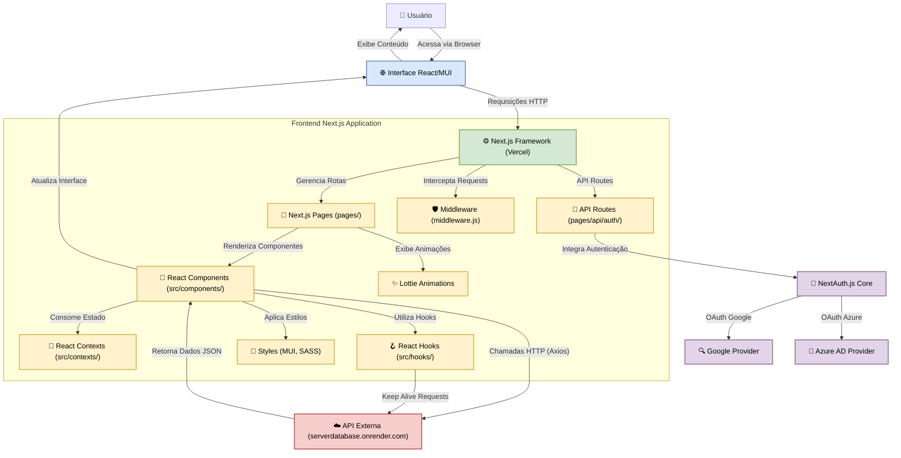

# ES Database V2 / Projects Portfolio

**Slogan Filosófico:** *Uma plataforma robusta e elegante para gerenciamento e visualização de conhecimento técnico e projetos, construída com Next.js e Material-UI.*

## Abstract (Resumo Técnico)

O ES Database V2 / Projects Portfolio emerge como uma solução sofisticada para a organização, apresentação e acesso eficiente a um corpus de conhecimento técnico, manifestado na forma de projetos ou procedimentos detalhados. No contexto da crescente complexidade e volume de informações em domínios técnicos, a necessidade de plataformas que facilitem a descoberta e a compreensão de tais dados é premente. Este projeto aborda o desafio de prover uma interface de usuário rica, intuitiva e performática, que permita não apenas a listagem, mas também a exploração aprofundada de cada item catalogado. A solução proposta é uma aplicação web desenvolvida sobre o framework Next.js, aproveitando suas capacidades de renderização (SSR/SSG), roteamento otimizado e desenvolvimento de APIs. A metodologia principal envolve uma arquitetura componentizada em React, com uma interface de usuário construída com Material-UI (MUI) para garantir consistência visual e acessibilidade, e estilização customizada via SASS e Emotion/Styled Components. O sistema oferece múltiplos modos de visualização (cards, lista detalhada, lista compacta), funcionalidade de busca dinâmica, e um sistema de autenticação (atualmente operando em um modo "fake login" para fins de demonstração, com suporte a provedores Google e Azure AD via NextAuth.js). Adicionalmente, o projeto se destaca pela experiência de usuário aprimorada através de animações Lottie e páginas de erro customizadas e informativas. O resultado é uma plataforma interativa, visualmente agradável e responsiva, projetada para servir como uma base de conhecimento centralizada, facilitando o acesso rápido e a compreensão de informações técnicas complexas. A contribuição principal reside na integração coesa de tecnologias modernas para criar um ambiente digital que valoriza tanto a estética quanto a funcionalidade na disseminação de conhecimento.

## Badges Abrangentes


<!-- Outros badges como Issues, Pull Requests, Last Commit, Top Language, Code Size seriam adicionados aqui se a URL do repositório fosse fornecida. -->

## Sumário (Table of Contents)

*   [ES Database V2 / Projects Portfolio](#es-database-v2--projects-portfolio)
    *   [Abstract (Resumo Técnico)](#abstract-resumo-técnico)
    *   [Badges Abrangentes](#badges-abrangentes)
    *   [Sumário (Table of Contents)](#sumário-table-of-contents)
    *   [Introdução e Motivação](#introdução-e-motivação)
    *   [🔗 Link Principal / Acesso ao Projeto](#-link-principal--acesso-ao-projeto)
    *   [Arquitetura do Sistema](#arquitetura-do-sistema)
    *   [Decisões de Design Chave](#decisões-de-design-chave)
    *   [✨ Funcionalidades Detalhadas (com Casos de Uso)](#-funcionalidades-detalhadas-com-casos-de-uso)
    *   [🛠️ Tech Stack Detalhado](#️-tech-stack-detalhado)
    *   [📂 Estrutura Detalhada do Código-Fonte](#-estrutura-detalhada-do-código-fonte)
    *   [📋 Pré-requisitos Avançados](#-pré-requisitos-avançados)
    *   [🚀 Guia de Instalação e Configuração Avançada](#-guia-de-instalação-e-configuração-avançada)
    *   [⚙️ Uso Avançado e Exemplos](#️-uso-avançado-e-exemplos)
    *   [🔧 API Reference (se aplicável)](#-api-reference-se-aplicável)
    *   [🧪 Estratégia de Testes e Qualidade de Código](#-estratégia-de-testes-e-qualidade-de-código)
    *   [🚢 Deployment Detalhado e Escalabilidade](#-deployment-detalhado-e-escalabilidade)
    *   [🤝 Contribuição (Nível Avançado)](#-contribuição-nível-avançado)
    *   [📜 Licença e Aspectos Legais](#-licença-e-aspectos-legais)
    *   [📚 Publicações, Artigos e Citações (se aplicável)](#-publicações-artigos-e-citações-se-aplicável)
    *   [👥 Equipe Principal e Colaboradores Chave](#-equipe-principal-e-colaboradores-chave)
    *   [🗺️ Roadmap Detalhado e Visão de Longo Prazo](#️-roadmap-detalhado-e-visão-de-longo-prazo)
    *   [❓ FAQ (Perguntas Frequentes)](#-faq-perguntas-frequentes)
    *   [📞 Contato e Suporte](#-contato-e-suporte)

## Introdução e Motivação

Em um cenário onde a informação técnica e os detalhes de projetos se acumulam rapidamente, a capacidade de organizar, acessar e compreender esse conhecimento de forma eficiente torna-se um diferencial estratégico. Muitas vezes, informações valiosas sobre procedimentos, arquiteturas de software, ou aprendizados de projetos anteriores ficam dispersas, subutilizadas ou são de difícil acesso, resultando em retrabalho, perda de tempo e uma curva de aprendizado íngreme para novos membros de equipes ou para consultas futuras. Soluções genéricas de armazenamento de documentos ou wikis, embora úteis, podem carecer da especialização e da experiência de usuário otimizada para a navegação e visualização de conteúdo técnico complexo, que frequentemente envolve código, diagramas e multimídia.

O ES Database V2 / Projects Portfolio foi concebido para preencher essa lacuna, oferecendo uma plataforma dedicada e visualmente atraente para a catalogação e apresentação de projetos e procedimentos técnicos. A proposta de valor central reside em fornecer uma experiência de usuário superior, combinando uma interface intuitiva e responsiva com múltiplas formas de visualização de dados (cards, listas detalhadas, listas compactas) e uma poderosa funcionalidade de busca. Isso permite que os usuários encontrem rapidamente a informação que necessitam e a consumam de maneira eficaz.

A motivação para o desenvolvimento deste projeto origina-se da necessidade de um sistema que não apenas armazene informações, mas que também as apresente de forma clara, organizada e esteticamente agradável, incentivando a exploração e o aprendizado. Objetiva-se criar um repositório central de conhecimento que possa servir como referência para equipes de desenvolvimento, estudantes, pesquisadores ou qualquer profissional que lide com projetos técnicos. A longo prazo, espera-se que a plataforma evolua para incorporar funcionalidades colaborativas e de gestão de conhecimento ainda mais avançadas, tornando-se uma ferramenta indispensável no ciclo de vida de projetos e na disseminação de expertise técnica.

## 🔗 Link Principal / Acesso ao Projeto

Você pode acessar a demonstração ao vivo do projeto ES Database V2 / Projects Portfolio através do seguinte link:

🚀 **[Acesse o Projeto Aqui](https://esdatabase-projmanage.vercel.app/login)**

Este link direciona para a página de login da aplicação, onde é possível explorar as funcionalidades de visualização e busca de projetos/procedimentos. Note que, na versão atual de demonstração, o sistema de autenticação opera em um modo "fake login" que redireciona automaticamente para a área principal após uma breve simulação.

## Arquitetura do Sistema

O ES Database V2 / Projects Portfolio é uma aplicação web full-stack construída primariamente com Next.js, adotando uma arquitetura modular e componentizada para facilitar a manutenção e escalabilidade.



**Componentes Principais e Fluxo:**

1.  **Interface do Usuário (UI):** Renderizada no navegador do cliente, construída com componentes React e Material-UI. É responsável por apresentar os dados e capturar as interações do usuário.
2.  **Frontend (Servidor Next.js - Vercel):**
    *   **Next.js Framework:** Orquestra a aplicação, lidando com Server-Side Rendering (SSR), Static Site Generation (SSG), roteamento baseado em sistema de arquivos, e otimizações.
    *   **Páginas Next.js (`pages/`):** Definem as rotas da aplicação. Incluem páginas principais como `index.js`, `login.js`, `components.js` (listagem principal), `procedimentos/[id].js` (detalhes), e páginas de erro customizadas (`400.js`, `401.js`, etc.).
    *   **Rotas de API Next.js (`pages/api/auth/`):** Utilizadas principalmente para a integração com NextAuth.js, lidando com os callbacks de autenticação.
    *   **Middleware (`middleware.js`):** Intercepta todas as requisições para aplicar lógica de roteamento e controle de acesso, redirecionando usuários para `/components` ou `/login` conforme necessário.
    *   **Componentes React (`src/components/`):** Blocos de construção reutilizáveis da UI, organizados em categorias como `Auth`, `Common`, `Layout`, `Lists`, `Procedures`.
    *   **Contextos React (`src/contexts/`):** Gerenciam estado global, como o `ThemeProvider` para alternância de tema dark/light.
    *   **Hooks React (`src/hooks/`):** Lógica reutilizável, como `useKeepAlive` para manter o backend externo ativo.
    *   **Estilos (`src/styles/`, MUI, SASS):** Definição da aparência da aplicação, utilizando temas MUI, SASS global e estilos componentizados (Emotion/Styled Components).
    *   **Animações Lottie (`src/animations/`):** Arquivos JSON para animações vetoriais leves usadas em páginas de erro e login.
3.  **Autenticação (NextAuth.js):**
    *   Gerencia o fluxo de autenticação com provedores externos como Google e Azure AD. O arquivo `pages/api/auth/[...nextauth].js` configura esses provedores. Atualmente, a página de login (`pages/login.js`) redireciona para uma simulação (`/fake-login/[type].js`) em vez de iniciar o fluxo OAuth real, provavelmente para fins de demonstração.
4.  **Backend Externo (`serverdatabase.onrender.com`):**
    *   Uma API externa responsável por fornecer os dados dos projetos/procedimentos. Os componentes frontend (ex: `CardList.js`, `ProcedurePages.js`) utilizam `axios` para fazer requisições HTTP a esta API.
    *   A dependência `pg` no `package.json` sugere que este backend provavelmente utiliza PostgreSQL como banco de dados.
    *   O hook `useKeepAlive` envia pings periódicos para este serviço, uma tática comum para manter aplicações em free tiers (como os do Render.com) ativas.

**Fluxo de Dados e Controle:**
*   O usuário acessa uma URL. O `middleware.js` primeiro avalia a requisição.
*   Se for uma rota protegida e o usuário não estiver autenticado (ou se for uma rota genérica), ele pode ser redirecionado para `/login` ou `/components`.
*   As páginas Next.js são renderizadas, buscando dados da API externa (`serverdatabase.onrender.com`) quando necessário (ex: ao listar cards ou visualizar detalhes de um procedimento).
*   A autenticação, quando ativada, seria gerenciada pelo NextAuth.js, que se comunicaria com os provedores OAuth (Google, Azure AD).
*   A UI é construída dinamicamente com componentes React, estilizados com MUI e SASS, e o estado global (como o tema) é gerenciado por Contextos React.

## Decisões de Design Chave

1.  **Framework Next.js:**
    *   **Justificativa:** Escolhido por suas robustas funcionalidades de renderização (SSR, SSG), roteamento baseado em sistema de arquivos que simplifica a organização, otimizações de performance (como code splitting e prefetching), e a capacidade de criar rotas de API integradas. Isso permite um desenvolvimento full-stack coeso dentro de um único framework.
    *   **Trade-offs:** Pode introduzir uma curva de aprendizado maior em comparação com bibliotecas React puras para frontend simples. A complexidade do build e deploy pode ser maior, embora plataformas como Vercel simplifiquem isso.

2.  **Material-UI (MUI) como Biblioteca de Componentes UI:**
    *   **Justificativa:** Oferece um conjunto extenso de componentes React pré-construídos, bem testados e acessíveis, seguindo as diretrizes do Material Design. Acelera o desenvolvimento da UI e garante consistência visual. O sistema de theming é poderoso e flexível.
    *   **Trade-offs:** Pode levar a uma aparência "padrão" se não customizado extensivamente. O tamanho do bundle pode aumentar se não houver cuidado com a importação de componentes (tree-shaking).

3.  **NextAuth.js para Autenticação:**
    *   **Justificativa:** Simplifica drasticamente a implementação de fluxos de autenticação com múltiplos provedores (OAuth, email, credentials). Lida com sessões, tokens JWT, e callbacks de forma segura e eficiente.
    *   **Trade-offs:** Introduz uma dependência externa e uma camada de abstração. A configuração, embora simplificada, ainda requer atenção aos detalhes de cada provedor.

4.  **Animações Lottie:**
    *   **Justificativa:** Permite o uso de animações vetoriais de alta qualidade que são leves, escaláveis e performáticas. Melhora significativamente a experiência do usuário em páginas de erro, login e outros pontos de interação.
    *   **Trade-offs:** Requer a criação ou obtenção de arquivos JSON de animação. A biblioteca `lottie-react` adiciona uma pequena dependência.

5.  **Páginas de Erro Customizadas (4xx, 5xx):**
    *   **Justificativa:** Em vez de exibir as páginas de erro padrão do navegador ou do framework, o projeto implementa páginas customizadas para cada código de status HTTP relevante (400, 401, 403, 404, 500, 503). Isso melhora a experiência do usuário, fornecendo mensagens mais amigáveis, contexto e, frequentemente, animações Lottie.
    *   **Trade-offs:** Aumenta ligeiramente o número de arquivos e a complexidade da pasta `pages`.

6.  **Middleware para Controle de Roteamento (`middleware.js`):**
    *   **Justificativa:** Permite centralizar a lógica de controle de acesso e redirecionamento antes que a requisição chegue às páginas. Isso é eficiente para proteger rotas ou garantir que o usuário seja direcionado para o local correto (ex: `/components` como página principal).
    *   **Trade-offs:** O código do middleware executa em Edge Functions (na Vercel), o que tem suas próprias limitações e características de performance.

7.  **"Fake Login" (`pages/fake-login/[type].js`):**
    *   **Justificativa:** Esta é uma decisão peculiar. Provavelmente implementada para fins de desenvolvimento rápido ou demonstração, permitindo acesso à área principal da aplicação (`/components`) sem a necessidade de configurar e usar credenciais reais de Google ou Microsoft. Evita a complexidade da configuração de OAuth em ambientes de desenvolvimento iniciais ou para demonstrações públicas.
    *   **Trade-offs:** Não fornece segurança real. Precisa ser substituído por uma implementação de login funcional para produção. Pode confundir usuários que esperam um login real.

8.  **API Externa para Dados (`serverdatabase.onrender.com`):**
    *   **Justificativa:** Desacopla o frontend da lógica de persistência e gerenciamento de dados. Permite que o backend seja desenvolvido e escalado independentemente.
    *   **Trade-offs:** Introduz uma dependência de rede e a necessidade de gerenciar a disponibilidade e performance de um serviço externo.

9.  **Hook `useKeepAlive`:**
    *   **Justificativa:** Uma solução pragmática para evitar que serviços hospedados em plataformas com free tiers (como Render.com) entrem em modo de suspensão (sleep) devido à inatividade. Envia pings periódicos para manter o serviço backend "acordado".
    *   **Trade-offs:** Adiciona tráfego de rede periódico. Não é uma solução ideal para ambientes de produção de alta criticidade, mas é eficaz para projetos pessoais ou de demonstração.

10. **Gerenciamento de Estado com Context API (`ThemeProvider`):**
    *   **Justificativa:** Para estados globais simples como a preferência de tema (dark/light), a Context API do React é uma solução leve e integrada, evitando a necessidade de bibliotecas de gerenciamento de estado mais pesadas como Redux ou Zustand.
    *   **Trade-offs:** Para estados mais complexos e atualizações frequentes, a Context API pode levar a re-renderizações desnecessárias se não otimizada cuidadosamente.

## ✨ Funcionalidades Detalhadas (com Casos de Uso)

O ES Database V2 / Projects Portfolio oferece um conjunto de funcionalidades projetadas para facilitar a visualização e o acesso a informações de projetos e procedimentos técnicos.

1.  **Visualização de Projetos/Procedimentos:**
    *   **Descrição:** A funcionalidade central da aplicação, permitindo aos usuários navegar por uma coleção de projetos ou procedimentos técnicos.
    *   **Modos de Visualização:**
        *   **Cards (`ViewModuleIcon`):** Apresenta cada item como um card visual, geralmente com uma imagem, título e uma breve descrição. Ideal para uma visão geral rápida e apelo visual.
            *   *Caso de Uso:* Um usuário deseja ter uma primeira impressão dos projetos disponíveis, focando em imagens e títulos para identificar rapidamente itens de interesse.
        *   **Lista Detalhada (`ViewListIcon`):** Exibe os itens em formato de lista, onde cada item pode mostrar uma imagem (avatar), título, descrição mais completa e metadados como data de criação.
            *   *Caso de Uso:* Um usuário precisa de mais detalhes contextuais sobre cada projeto sem necessariamente abrir a página de detalhes completa, como uma breve sinopse e data de criação.
        *   **Lista Compacta (`ViewCompactIcon`):** Uma visualização mais densa, geralmente mostrando apenas um avatar (ou inicial do título) e o título, com uma descrição muito curta. Otimizada para exibir muitos itens em um espaço limitado.
            *   *Caso de Uso:* Um usuário experiente quer escanear rapidamente uma longa lista de projetos, focando principalmente nos títulos para encontrar um item específico.
    *   **Controles de Visualização:** O usuário pode alternar entre esses modos de visualização através de botões na barra de ferramentas da página `components.js`. A preferência de visualização pode ser salva (usando cookies) e também se adaptar automaticamente à largura da tela. Há um botão para resetar para o modo automático.

2.  **Ordenação de Conteúdo:**
    *   **Descrição:** Permite que os usuários ordenem a lista de projetos/procedimentos com base em diferentes critérios e direções.
    *   **Critérios de Ordenação:**
        *   Data de Criação (`CalendarPlus` icon)
        *   Ordem Alfabética (Título) (`ArrowUpAZ`, `ArrowDownAZ` icons)
        *   Data de Modificação (`Clock` icon - inferido, não explicitamente no código, mas `updateDate` é uma opção)
    *   **Direção da Ordenação:** Ascendente (A-Z, Mais Antigo Primeiro) ou Descendente (Z-A, Mais Novo Primeiro).
    *   **Controles:** Acessível através de um menu (`MoreVertIcon`) na página `components.js`. As preferências de ordenação também são salvas em cookies.
    *   *Caso de Uso:* Um usuário deseja ver os projetos mais recentes primeiro (ordena por Data de Criação, descendente) ou encontrar um projeto específico pelo nome (ordena por Título, ascendente).

3.  **Busca de Projetos/Procedimentos:**
    *   **Descrição:** Uma caixa de busca (`SearchBox.js`) localizada no AppBar permite que os usuários pesquisem projetos/procedimentos por título ou descrição.
    *   **Funcionalidade:** Conforme o usuário digita, a aplicação faz uma requisição à API (`https://serverdatabase.onrender.com/api/v1/search`) e exibe sugestões de autocompletar. Ao selecionar um resultado, o usuário é redirecionado para a página de detalhes do item.
    *   *Caso de Uso:* Um usuário lembra de uma palavra-chave ou parte do título de um projeto e a utiliza na busca para encontrá-lo rapidamente.

4.  **Página de Detalhes do Procedimento/Projeto (`procedimentos/[id].js`):**
    *   **Descrição:** Ao clicar em um item da lista, o usuário é levado a uma página dedicada (`ProcedureDetails.js`) que exibe o conteúdo completo do projeto/procedimento.
    *   **Renderização de Conteúdo:**
        *   O conteúdo é primariamente em Markdown, processado pela biblioteca `marked` e sanitizado com `DOMPurify` para segurança.
        *   Suporte a sintaxe de código com highlight (usando `highlight.js`).
        *   **Vídeos do YouTube:** Links do YouTube no conteúdo são automaticamente convertidos em players de vídeo incorporados, com opção de carregar sob demanda e expandir.
        *   **Botões de Cópia:** Texto delimitado por `@@texto para copiar@@` é transformado em um botão que, ao ser clicado, copia o "texto para copiar" para a área de transferência do usuário, com feedback via toast.
        *   **Links:** Todos os links externos abrem em uma nova aba.
    *   *Caso de Uso:* Um usuário seleciona um projeto de interesse e navega até sua página de detalhes para ler a documentação completa, visualizar código, assistir a vídeos demonstrativos e copiar trechos de código ou comandos úteis.

5.  **Autenticação de Usuário (Simulada):**
    *   **Descrição:** O sistema possui integração com NextAuth.js para autenticação via Google e Microsoft Azure AD (`pages/api/auth/[...nextauth].js`). No entanto, a página de login (`pages/login.js`) atualmente redireciona para uma página de "fake login" (`pages/fake-login/[type].js`).
    *   **Fake Login:** Esta página exibe uma animação Lottie e uma mensagem humorística, e então redireciona o usuário para a página principal (`/components`) após um contador. Isso permite o acesso à aplicação sem necessidade de credenciais reais, útil para desenvolvimento ou demonstração.
    *   **Callback de SignIn:** O callback `signIn` em `[...nextauth].js` está configurado para permitir o login apenas para e-mails específicos (ex: `sousa3086@outlook.com`), indicando que uma autenticação real já foi parcialmente implementada ou planejada.
    *   *Caso de Uso (Simulado):* Um usuário clica em "Entrar com Google" ou "Entrar com Microsoft" na página de login, é apresentado a uma tela de simulação e, em seguida, é automaticamente "logado" e redirecionado para a lista de projetos.

6.  **Páginas de Erro Customizadas e Informativas:**
    *   **Descrição:** O projeto implementa páginas de erro customizadas para os códigos HTTP 400, 401, 403, 404, 500 e 503. Uma página de erro genérica (`GenericError.js`) e um `ErrorGateway.js` também são usados.
    *   **Funcionalidade:** Cada página de erro exibe uma animação Lottie relevante, uma mensagem explicando o erro de forma amigável e um link para voltar à página inicial ou tentar novamente.
    *   *Caso de Uso:* Se um usuário tenta acessar uma página inexistente, ele vê a página 404 customizada em vez de uma página de erro padrão do navegador. Se ocorre um erro no servidor, a página 500 é exibida.

7.  **Alternância de Tema (Dark/Light Mode):**
    *   **Descrição:** A aplicação suporta temas claro e escuro, com a capacidade de alternar entre eles.
    *   **Funcionalidade:** Um botão no AppBar (`Brightness4Icon`/`Brightness7Icon`) permite ao usuário alternar o tema. A preferência do sistema do usuário é detectada inicialmente (`CustomThemeProvider.js`), e a escolha pode ser persistida (o `_document.js` inclui um script para aplicar o tema antes da hidratação para evitar FOUC - Flash Of Unstyled Content).
    *   *Caso de Uso:* Um usuário prefere trabalhar com um tema escuro para reduzir o cansaço visual e pode facilmente alternar para ele.

8.  **Menu Lateral Navegável por Categorias (`Drawer.js`):**
    *   **Descrição:** Um menu lateral (drawer) pode ser aberto para exibir uma lista de categorias de projetos/procedimentos.
    *   **Funcionalidade:** O drawer busca as categorias e seus respectivos itens da API. Cada categoria pode ser expandida para mostrar os itens dentro dela. Clicar em um item navega para sua página de detalhes. O drawer é responsivo e pode ser aberto/fechado.
    *   *Caso de Uso:* Um usuário deseja explorar projetos agrupados por uma tecnologia ou tipo específico (ex: "HTML", "Python").

9.  **Timeout de Sessão e Logout Automático:**
    *   **Descrição:** Implementado na página `components.js`, há um timeout de sessão de 4 horas.
    *   **Funcionalidade:** Se o usuário permanecer inativo por 4 horas, a sessão é encerrada (via `signOut` do NextAuth.js) e um diálogo informa sobre a expiração, oferecendo a opção de redirecionar para a página de login. Qualquer atividade do usuário (mouse, teclado, scroll) reseta o timer.
    *   *Caso de Uso:* Para segurança, se um usuário deixar a aplicação aberta e inativa por um longo período, ele é automaticamente deslogado.

10. **Rodapé Informativo:**
    *   **Descrição:** Um rodapé discreto nas páginas de detalhes e no menu lateral credita o desenvolvedor e as tecnologias principais.
    *   *Funcionalidade:* "Desenvolvido por José Enoque ✦ Powered by React & Next.js".

## 🛠️ Tech Stack Detalhado

A plataforma ES Database V2 / Projects Portfolio é construída utilizando um conjunto moderno de tecnologias, visando performance, escalabilidade e uma excelente experiência de desenvolvimento e de usuário.

| Categoria         | Tecnologia                                   | Versão Específica (do `package.json`) | Propósito no Projeto                                                                                                | Justificativa da Escolha                                                                                                                                                                                                                                                                                                                                                                                                                                                                                                                                                                                                                   |
| :---------------- | :------------------------------------------- | :------------------------------------ | :------------------------------------------------------------------------------------------------------------------ | :----------------------------------------------------------------------------------------------------------------------------------------------------------------------------------------------------------------------------------------------------------------------------------------------------------------------------------------------------------------------------------------------------------------------------------------------------------------------------------------------------------------------------------------------------------------------------------------------------------------------------------------- |
| **Frontend**      | Next.js                                      | `^14.1.4`                             | Framework principal para React, provendo SSR, SSG, roteamento, API routes, e otimizações.                         | Permite construir aplicações React rápidas e SEO-friendly com excelente DX. A estrutura baseada em páginas simplifica o roteamento.                                                                                                                                                                                                                                                                                                                                                                                                                                                                                                     |
|                   | React                                        | `^18.2.0`                             | Biblioteca JavaScript para construção de interfaces de usuário componentizadas.                                   | Padrão da indústria para UIs dinâmicas e reativas, com um vasto ecossistema.                                                                                                                                                                                                                                                                                                                                                                                                                                                                                                                                                              |
|                   | Material-UI (MUI)                            | `@mui/material: ^5.15.14`             | Biblioteca de componentes React que implementa o Material Design.                                                   | Fornece componentes UI prontos, customizáveis e acessíveis, acelerando o desenvolvimento e garantindo consistência visual.                                                                                                                                                                                                                                                                                                                                                                                                                                                                                                   |
|                   | Emotion                                      | `@emotion/react: ^11.11.4`            | Biblioteca para estilização CSS-in-JS, usada internamente pelo MUI v5+.                                             | Permite estilização componentizada e dinâmica, com bom desempenho.                                                                                                                                                                                                                                                                                                                                                                                                                                                                                                                                                         |
|                   | Styled Components                            | `5.3.5`                               | Biblioteca para estilização CSS-in-JS (uso possivelmente legado ou em componentes específicos).                       | Semelhante ao Emotion, permite criar componentes com estilos encapsulados.                                                                                                                                                                                                                                                                                                                                                                                                                                                                                                                                                 |
|                   | SASS                                         | `1.66.1`                              | Pré-processador CSS que adiciona funcionalidades como variáveis, nesting, mixins.                                     | Usado para estilos globais (`src/styles/global.scss`) e possivelmente em componentes mais antigos, oferecendo maior poder e organização para CSS.                                                                                                                                                                                                                                                                                                                                                                                                                                                                       |
|                   | Lottie-React                                 | `^2.4.1`                              | Componente React para renderizar animações Lottie (JSON).                                                           | Permite animações vetoriais leves e de alta qualidade para melhorar a UX (ex: páginas de erro, login).                                                                                                                                                                                                                                                                                                                                                                                                                                                                                                                 |
|                   | Framer Motion                                | `^11.18.2` (devDependencies)          | Biblioteca para animações complexas e interativas em React.                                                         | Usada para transições e animações de UI sofisticadas (ex: nas páginas de erro).                                                                                                                                                                                                                                                                                                                                                                                                                                                                                                                                                     |
| **Autenticação**  | NextAuth.js                                  | `^4.24.7`                             | Solução completa de autenticação para aplicações Next.js.                                                           | Facilita a integração com diversos provedores OAuth (Google, Azure AD neste projeto) e o gerenciamento de sessões.                                                                                                                                                                                                                                                                                                                                                                                                                                                                                                     |
|                   | Google Provider (next-auth)                  | N/A (parte do NextAuth.js)            | Provedor para autenticação com contas Google.                                                                       | Oferece uma opção de login familiar e amplamente utilizada.                                                                                                                                                                                                                                                                                                                                                                                                                                                                                                                                                              |
|                   | Azure AD Provider (next-auth)                | N/A (parte do NextAuth.js)            | Provedor para autenticação com contas Microsoft Azure Active Directory.                                           | Permite integração com ecossistemas corporativos da Microsoft.                                                                                                                                                                                                                                                                                                                                                                                                                                                                                                                                                           |
| **Comunicação API** | Axios                                      | `^1.6.8`                              | Cliente HTTP baseado em Promises para navegador e Node.js.                                                          | Usado para realizar requisições à API externa (`serverdatabase.onrender.com`) de forma organizada.                                                                                                                                                                                                                                                                                                                                                                                                                                                                                                                    |
| **Utilitários**   | date-fns                                     | `^3.6.0`                              | Biblioteca moderna para manipulação de datas em JavaScript.                                                         | Usada para formatar datas (ex: em `DetailedList.js`).                                                                                                                                                                                                                                                                                                                                                                                                                                                                                                                                                                |
|                   | moment                                       | `2.29.4`                              | Biblioteca para parsing, validação, manipulação e formatação de datas (uso possivelmente legado).                   | Embora poderosa, `date-fns` ou `Day.js` são alternativas mais modernas e leves. Pode ser um resquício do template original.                                                                                                                                                                                                                                                                                                                                                                                                                                                                                             |
|                   | DOMPurify                                    | `^3.0.11`                             | Sanitizador de HTML rápido e robusto contra XSS.                                                                    | Essencial para renderizar conteúdo Markdown/HTML de forma segura, prevenindo ataques XSS. Usado em `ProcedureDetails.js`.                                                                                                                                                                                                                                                                                                                                                                                                                                                                                                |
|                   | Marked                                       | `^15.0.7`                             | Parser Markdown de baixo nível e alta velocidade.                                                                   | Usado para converter texto Markdown do backend em HTML para exibição em `ProcedureDetails.js`.                                                                                                                                                                                                                                                                                                                                                                                                                                                                                                                          |
|                   | highlight.js                                 | `^11.11.1`                            | Biblioteca para syntax highlighting de código em diversas linguagens.                                                 | Usada para destacar blocos de código dentro do conteúdo Markdown em `ProcedureDetails.js`.                                                                                                                                                                                                                                                                                                                                                                                                                                                                                                                                |
|                   | js-cookie                                    | `^3.0.5`                              | API JavaScript simples e leve para manipulação de cookies.                                                          | Utilizado em `components.js` para persistir preferências do usuário como modo de visualização e ordenação.                                                                                                                                                                                                                                                                                                                                                                                                                                                                                                                      |
|                   | nookies                                      | `^2.5.2`                              | Coleção de helpers para manipulação de cookies em Next.js (client-side e server-side).                              | Usado em `components.js` (getServerSideProps) para ler cookies no lado do servidor.                                                                                                                                                                                                                                                                                                                                                                                                                                                                                                                                     |
|                   | classnames                                   | `2.3.2`                               | Utilitário JavaScript simples para unir condicionalmente `className`s.                                              | Facilita a aplicação dinâmica de classes CSS.                                                                                                                                                                                                                                                                                                                                                                                                                                                                                                                                                                      |
|                   | prop-types                                   | `15.8.1`                              | Validação de tipos para props em componentes React.                                                                 | Ajuda a garantir a integridade dos dados passados aos componentes durante o desenvolvimento.                                                                                                                                                                                                                                                                                                                                                                                                                                                                                                                             |
|                   | lucide-react                                 | `^0.487.0`                            | Biblioteca de ícones SVG leves e customizáveis.                                                                     | Usada para ícones como `CalendarPlus`, `Clock`, `ArrowUpAZ` em `components.js`.                                                                                                                                                                                                                                                                                                                                                                                                                                                                                                                                      |
|                   | react-icons                                  | `^5.5.0`                              | Biblioteca que inclui ícones populares de diversos conjuntos (ex: Simple Icons).                                      | Usada em `CategoryIconMapper.js` para ícones de linguagens (SiHtml5, SiCss3, etc.).                                                                                                                                                                                                                                                                                                                                                                                                                                                                                                                                |
| **Backend (Inferido)** | Node.js/Express (ou similar)           | N/A                                   | Plataforma/Framework para a API em `serverdatabase.onrender.com`.                                                   | Escolha comum para APIs RESTful, especialmente no ecossistema JavaScript.                                                                                                                                                                                                                                                                                                                                                                                                                                                                                                                                |
|                   | PostgreSQL                                   | `pg: ^8.11.3` (client no frontend)    | Sistema de Gerenciamento de Banco de Dados Relacional.                                                              | A presença da biblioteca cliente `pg` sugere que o backend utiliza PostgreSQL para persistência de dados. É um SGBD robusto e popular.                                                                                                                                                                                                                                                                                                                                                                                                                                                                                           |
| **DevOps**        | Vercel                                       | N/A                                   | Plataforma de deployment otimizada para Next.js e Jamstack.                                                       | Inferido pelo link do projeto (`vercel.app`). Oferece CI/CD integrado, SSL, e escalabilidade global para frontends.                                                                                                                                                                                                                                                                                                                                                                                                                                                                                            |
|                   | Render.com                                   | N/A                                   | Plataforma de nuvem para hospedar serviços web, APIs, bancos de dados.                                              | Inferido pelo URL da API (`onrender.com`). O hook `useKeepAlive` sugere o uso de um free tier.                                                                                                                                                                                                                                                                                                                                                                                                                                                                                                                    |
|                   | pnpm                                         | N/A (indicado por `pnpm-lock.yaml`)   | Gerenciador de pacotes rápido e eficiente em disco para Node.js.                                                    | O arquivo `pnpm-lock.yaml` e `.npmrc` com `shamefully-hoist=true` indicam seu uso.                                                                                                                                                                                                                                                                                                                                                                                                                                                                                                                         |
| **Linting/Formatting** | Prettier                               | N/A (indicado por `.prettierignore`)  | Formatador de código opinativo.                                                                                     | A presença do `.prettierignore` sugere o uso de Prettier para manter a consistência do estilo de código.                                                                                                                                                                                                                                                                                                                                                                                                                                                                                                                    |
|                   | TypeScript                                   | `^5.4.4` (devDependencies)            | Superset de JavaScript que adiciona tipagem estática.                                                               | Embora o projeto seja majoritariamente JavaScript (`.js`), a presença de TypeScript nas `devDependencies` e arquivos `.d.ts` (não listados, mas comuns) sugere que pode haver planos de migração ou uso em partes específicas, ou que o template original tinha suporte. Arquivos como `CategoryIconMapper.js` usam JSDoc para tipagem.                                                                                                                                                                                                                                                                                             |

## 📂 Estrutura Detalhada do Código-Fonte

O projeto `esdatabasev2-main` adota uma estrutura de diretórios característica de aplicações Next.js, organizada para separar preocupações e facilitar a navegação e manutenção do código.

```
esdatabasev2-main/
├── .gitignore               # Especifica arquivos e pastas ignorados pelo Git.
├── .npmrc                   # Configurações para o pnpm (ex: shamefully-hoist).
├── .prettierignore          # Arquivos e pastas a serem ignorados pelo Prettier.
├── CHANGELOG.md             # Histórico de mudanças (originalmente do template base).
├── ISSUE_TEMPLATE.md        # Template para reportar issues (originalmente do template).
├── LICENSE.md               # Licença MIT do projeto (Copyright ES Data Base).
├── middleware.js            # Middleware Next.js para controle de rotas e acesso.
├── next.config.js           # Configurações do Next.js (ex: reactStrictMode).
├── package.json             # Metadados do projeto, scripts e dependências.
├── pnpm-lock.yaml           # Lockfile do pnpm, garante instalações consistentes.
├── pages/                   # Diretório principal do Next.js para roteamento.
│   ├── 400.js               # Página customizada para erro 400 (Bad Request).
│   ├── 401.js               # Página customizada para erro 401 (Unauthorized).
│   ├── 403.js               # Página customizada para erro 403 (Forbidden).
│   ├── 404.js               # Página customizada para erro 404 (Not Found).
│   ├── 500.js               # Página customizada para erro 500 (Internal Server Error).
│   ├── 503.js               # Página customizada para erro 503 (Service Unavailable).
│   ├── _app.js              # Componente raiz da aplicação, para inicializações globais.
│   ├── _document.js         # Customiza o HTML base da aplicação (ex: lang, meta tags).
│   ├── _error.js            # Página de erro genérica do Next.js, usa ErrorGateway.
│   ├── api/                 # Rotas de API do Next.js.
│   │   └── auth/
│   │       └── [...nextauth].js # Configuração do NextAuth.js para autenticação.
│   ├── components.js        # Página principal de listagem de projetos/procedimentos.
│   ├── erro.js              # Página de erro customizada que usa ErrorGateway com query param.
│   ├── fake-login/
│   │   └── [type].js        # Página de simulação de login para diferentes provedores.
│   ├── index.js             # Página inicial (atualmente simples, com toggle de tema).
│   ├── login.js             # Página de login da aplicação.
│   └── procedimentos/
│       └── [id].js          # Rota dinâmica para exibir detalhes de um procedimento/projeto.
├── public/                  # Arquivos estáticos servidos diretamente.
│   ├── .well-known/         # Usado para verificações de identidade (ex: Microsoft).
│   │   └── microsoft-identity-association.json
│   ├── assets/              # Imagens e outros assets de projetos.
│   │   └── projects0002/    # Exemplo de pasta de assets para um projeto.
│   │       └── projects0002__1.png
│   │   └── ... (outras pastas de projetos)
│   └── googleeeb9045c64dbe223.html # Verificação do Google Site.
└── src/                     # Código fonte principal da aplicação.
    ├── animations/          # Arquivos JSON para animações Lottie.
    │   ├── confetti.json
    │   ├── erro-400.json
    │   └── ... (outras animações de erro e login)
    ├── components/          # Componentes React reutilizáveis.
    │   ├── Auth/            # Componentes relacionados à autenticação.
    │   │   ├── GoogleIcon.js
    │   │   ├── LoginForm.js
    │   │   └── MicrosoftIcon.js
    │   ├── Common/          # Componentes genéricos e utilitários.
    │   │   ├── CategoryIconMapper.js # Mapeia categorias para ícones.
    │   │   ├── ErrorBoundary.js    # Captura erros em componentes filhos.
    │   │   ├── ErrorGateway.js     # Direciona para a página de erro correta.
    │   │   ├── GenericError.js     # Componente para erros genéricos.
    │   │   ├── Modal.js            # Componente de modal genérico.
    │   │   └── SearchBox/        # Componentes da caixa de busca.
    │   │       ├── SearchBox.js
    │   │       ├── SearchBoxContainer.js
    │   │       └── SearchBoxStyles.js
    │   ├── Layout/            # Componentes de layout da aplicação.
    │   │   ├── AppBar.js
    │   │   ├── Drawer.js         # Menu lateral.
    │   │   └── MainLayout.js     # Layout principal que envolve as páginas.
    │   ├── Lists/             # Componentes para diferentes visualizações de lista.
    │   │   ├── CardList/
    │   │   ├── CompactList/
    │   │   ├── DetailedList/
    │   │   └── ListView/         # Componente que alterna entre os tipos de lista.
    │   ├── Procedures/        # Componentes para a página de detalhes do procedimento.
    │   │   ├── ProcedureDetails.js
    │   │   ├── ProcedureDetailsStyles.js
    │   │   ├── ProcedurePages.js   # Wrapper para ProcedureDetails em MainLayout.
    │   │   └── styles.module.css # Estilos CSS Modules (ex: para tabelas).
    │   ├── StyleLink/         # Componentes de link estilizados.
    │   │   └── StyledLink.js
    │   ├── pages/             # Estilos específicos para componentes de página.
    │   │   └── ComponentsPageStyled.js
    │   └── utils/             # Funções utilitárias.
    │       └── apiErrorHandler.js # Manipulador de erros de API.
    ├── contexts/              # Contextos React para gerenciamento de estado global.
    │   └── ThemeProvider.js   # Provedor para o tema da aplicação (dark/light).
    ├── hooks/                 # Hooks React customizados.
    │   └── useKeepAlive.js    # Hook para enviar pings e manter o backend ativo.
    └── styles/                # Estilos globais e configurações de tema.
        ├── global.scss        # Estilos SCSS globais (atualmente vazio).
        ├── layout/
        │   └── _layoutStyles.js # Estilos para componentes de layout (AppBar).
        ├── procedures/
        │   └── _procedureStyles.js # (Vazio, mas estrutura existe).
        ├── theme.js           # Definições dos temas light e dark para MUI.
        └── variables.js       # (Vazio, mas estrutura existe para variáveis de estilo).
```

**Filosofia da Estrutura:**

*   **Next.js Convencional:** A pasta `pages/` dita o roteamento da aplicação, com arquivos `_app.js` e `_document.js` para customizações globais. A pasta `public/` serve arquivos estáticos.
*   **Separação de Código Fonte (`src/`):** Todo o código da aplicação (componentes, contextos, hooks, estilos específicos) reside na pasta `src/`, mantendo a raiz do projeto mais limpa.
*   **Modularidade em Componentes:** A pasta `src/components/` é organizada por funcionalidade ou tipo (Auth, Common, Layout, Lists, Procedures), promovendo a reutilização e a fácil localização dos componentes.
*   **Estilização Híbrida:** O projeto utiliza uma combinação de Material-UI (com seu sistema de theming e `styled`), SASS (para estilos globais, embora `global.scss` esteja vazio) e CSS Modules (ex: `styles.module.css` em `Procedures`).
*   **Animações Centralizadas:** As animações Lottie estão agrupadas em `src/animations/`, facilitando sua gestão.
*   **Contexto para Estado Global:** O `src/contexts/` é usado para estados que precisam ser compartilhados por toda a aplicação, como o tema.

Esta estrutura promove uma boa organização e separação de responsabilidades, facilitando o desenvolvimento e a manutenção do projeto.

## 📋 Pré-requisitos Avançados

Para instalar, configurar e executar o ES Database V2 / Projects Portfolio em um ambiente de desenvolvimento, os seguintes pré-requisitos são necessários:

1.  **Node.js:**
    *   **Versão Mínima:** Recomenda-se a versão LTS mais recente ou superior (ex: Node.js 18.x ou 20.x). O Next.js 14 requer Node.js 18.17 ou posterior.
    *   Verifique sua versão com `node -v`.

2.  **Gerenciador de Pacotes `pnpm`:**
    *   O projeto utiliza `pnpm` como gerenciador de pacotes, indicado pela presença do arquivo `pnpm-lock.yaml` e do arquivo `.npmrc` com a configuração `shamefully-hoist=true`.
    *   Instale o `pnpm` globalmente, se ainda não o tiver: `npm install -g pnpm`.
    *   Verifique sua versão com `pnpm -v`.

3.  **Git:**
    *   Necessário para clonar o repositório.
    *   Verifique sua versão com `git --version`.

4.  **Variáveis de Ambiente:**
    *   O projeto utiliza variáveis de ambiente para configurar os provedores de autenticação NextAuth.js. Crie um arquivo `.env.local` na raiz do projeto e adicione as seguintes variáveis, substituindo os valores pelos seus próprios (obtidos ao configurar os aplicativos OAuth no Google Cloud Console e Azure Portal):
        ```env
        # Provedor Azure AD
        AZURE_AD_CLIENT_ID=SEU_AZURE_AD_CLIENT_ID
        AZURE_AD_CLIENT_SECRET=SEU_AZURE_AD_CLIENT_SECRET
        AZURE_AD_TENANT_ID=SEU_AZURE_AD_TENANT_ID

        # Provedor Google
        GOOGLE_CLIENT_ID=SEU_GOOGLE_CLIENT_ID
        GOOGLE_CLIENT_SECRET=SEU_GOOGLE_CLIENT_SECRET

        # NextAuth.js Secret (gere um valor aleatório seguro)
        # Exemplo: openssl rand -base64 32
        NEXTAUTH_SECRET=SEU_NEXTAUTH_SECRET_ALEATORIO

        # URL da aplicação (importante para NextAuth.js em produção/ambientes específicos)
        # Para desenvolvimento local, geralmente é http://localhost:3000
        NEXTAUTH_URL=http://localhost:3000
        ```
    *   **Nota:** Para a funcionalidade de "fake login" atual, essas variáveis podem não ser estritamente necessárias para rodar a aplicação localmente, mas são cruciais se você pretende habilitar a autenticação real.

5.  **Sistema Operacional:**
    *   Compatível com Node.js (Windows, macOS, Linux).

6.  **Navegador Web Moderno:**
    *   Para visualização e interação com a aplicação (ex: Chrome, Firefox, Edge, Safari).

Certificar-se de que todos esses pré-requisitos estão atendidos garantirá um processo de instalação e configuração mais suave.

## 🚀 Guia de Instalação e Configuração Avançada

Siga os passos abaixo para configurar e executar o projeto ES Database V2 / Projects Portfolio em seu ambiente de desenvolvimento local.

1.  **Clonar o Repositório:**
    Abra seu terminal ou prompt de comando e clone o repositório do projeto.
    *(Como o link do repositório não foi fornecido, usaremos um placeholder. Substitua `URL_DO_REPOSITORIO_AQUI` pelo link correto se disponível).*
    ```bash
    git clone URL_DO_REPOSITORIO_AQUI
    cd esdatabasev2-main
    ```
    Se você baixou o arquivo .zip, descompacte-o e navegue até o diretório `esdatabasev2-main`.

2.  **Instalar Dependências:**
    O projeto utiliza `pnpm` como gerenciador de pacotes. Certifique-se de tê-lo instalado (veja Pré-requisitos). Em seguida, instale as dependências do projeto:
    ```bash
    pnpm install
    ```
    Este comando lerá o arquivo `package.json` e `pnpm-lock.yaml` para instalar todas as dependências necessárias.

3.  **Configurar Variáveis de Ambiente:**
    *   Crie um arquivo chamado `.env.local` na raiz do diretório `esdatabasev2-main`.
    *   Copie o conteúdo abaixo para o arquivo `.env.local` e substitua os valores placeholder pelas suas credenciais reais dos provedores OAuth e um `NEXTAUTH_SECRET` seguro.
        ```env
        # Provedor Azure AD
        AZURE_AD_CLIENT_ID=SEU_AZURE_AD_CLIENT_ID_AQUI
        AZURE_AD_CLIENT_SECRET=SEU_AZURE_AD_CLIENT_SECRET_AQUI
        AZURE_AD_TENANT_ID=SEU_AZURE_AD_TENANT_ID_AQUI

        # Provedor Google
        GOOGLE_CLIENT_ID=SEU_GOOGLE_CLIENT_ID_AQUI
        GOOGLE_CLIENT_SECRET=SEU_GOOGLE_CLIENT_SECRET_AQUI

        # NextAuth.js Secret
        # Gere um valor seguro, por exemplo, usando: openssl rand -base64 32
        NEXTAUTH_SECRET=SEU_NEXTAUTH_SECRET_ALEATORIO_AQUI

        # URL da aplicação para NextAuth.js
        NEXTAUTH_URL=http://localhost:3000
        ```
    *   **`NEXTAUTH_SECRET`**: É crucial para a segurança do NextAuth.js. Você pode gerar um usando o comando `openssl rand -base64 32` no terminal (Linux/macOS) ou uma ferramenta online para gerar strings aleatórias seguras.
    *   **Nota sobre "Fake Login"**: A aplicação atualmente utiliza um sistema de "fake login" que contorna a necessidade dessas credenciais para acessar a área principal. No entanto, para habilitar a autenticação real ou para desenvolvimento futuro da funcionalidade de autenticação, essas variáveis são essenciais.

4.  **Executar a Aplicação em Modo de Desenvolvimento:**
    Após a instalação das dependências e configuração das variáveis de ambiente, inicie o servidor de desenvolvimento:
    ```bash
    pnpm dev
    ```
    Este comando iniciará a aplicação Next.js, geralmente na porta `3000`.

5.  **Acessar a Aplicação:**
    Abra seu navegador e acesse [http://localhost:3000](http://localhost:3000). Você deverá ver a página de login da aplicação.

**Docker / Docker Compose (Não Configurado no Projeto Fornecido):**
O projeto, conforme os arquivos fornecidos, não inclui um `Dockerfile` ou `docker-compose.yml`. Se a containerização for um requisito futuro, estes seriam os passos gerais:

*   **Criar um `Dockerfile`:**
    *   Definir uma imagem base Node.js.
    *   Copiar `package.json`, `pnpm-lock.yaml`, e `.npmrc`.
    *   Instalar dependências usando `pnpm install`.
    *   Copiar o restante do código da aplicação.
    *   Construir a aplicação com `pnpm build`.
    *   Expor a porta correta (geralmente 3000).
    *   Definir o comando para iniciar a aplicação em produção (`pnpm start`).
*   **(Opcional) Criar `docker-compose.yml`:**
    *   Definir o serviço da aplicação Next.js baseado no `Dockerfile`.
    *   Configurar volumes, portas e variáveis de ambiente.
    *   Potencialmente, adicionar outros serviços como um banco de dados PostgreSQL, se o backend externo fosse internalizado.

Por enquanto, siga os passos de instalação manual para rodar o projeto localmente.

## ⚙️ Uso Avançado e Exemplos

Após instalar e iniciar a aplicação, você pode explorar suas funcionalidades:

1.  **Navegação e Visualização de Conteúdo:**
    *   Acesse a página principal (geralmente `/components` após o "login").
    *   **Alternar Modos de Visualização:** Utilize os ícones na barra de ferramentas para alternar entre:
        *   `ViewModuleIcon` (Cards): Visualização em grade com imagens e títulos.
        *   `ViewListIcon` (Lista Detalhada): Lista com mais detalhes, incluindo descrição e datas.
        *   `ViewCompactIcon` (Lista Compacta): Lista densa, focada em títulos.
    *   **Resetar Visualização:** O ícone `RestartAltIcon` redefine a visualização para o modo automático, que se ajusta à largura da tela.

2.  **Ordenação de Conteúdo:**
    *   Clique no ícone `MoreVertIcon` (Mais Opções) na barra de ferramentas.
    *   Selecione um critério de ordenação:
        *   `CalendarPlus` (Data de Criação)
        *   `Clock` (Data de Modificação - se implementado)
        *   `ArrowUpAZ` / `ArrowDownAZ` (Ordem Alfabética)
    *   Clique novamente no ícone de critério ou no ícone de direção para alternar entre ascendente (`asc`) e descendente (`desc`).
    *   As preferências de visualização e ordenação são salvas em cookies para persistência entre sessões.

3.  **Busca:**
    *   Utilize a caixa de busca no canto superior direito do AppBar.
    *   Digite termos relacionados ao título ou descrição do projeto/procedimento que você procura.
    *   A lista de sugestões será atualizada dinamicamente.
    *   Clique em uma sugestão para navegar diretamente para a página de detalhes do item.

4.  **Página de Detalhes do Procedimento (`/procedimentos/[id]`):**
    *   **Conteúdo Markdown:** O conteúdo principal é renderizado a partir de Markdown, suportando formatação de texto, listas, tabelas, etc.
    *   **Blocos de Código:** Blocos de código são destacados sintaticamente (usando `highlight.js`).
    *   **Vídeos Incorporados:** Links do YouTube no conteúdo são transformados em players de vídeo.
        *   Clique em "Carregar Vídeo" para exibir o player.
        *   Use o botão "Expandir"/"Minimizar" no player para alterar seu tamanho.
    *   **Botões de Cópia:** Seções de texto delimitadas por `@@texto@@` no Markdown original se tornam botões clicáveis. Clicar neles copia o `texto` para sua área de transferência, e uma notificação (toast) confirma a ação.
    *   **Links Externos:** Todos os links no conteúdo abrem em uma nova aba por padrão.

5.  **Alternância de Tema:**
    *   Clique no ícone de Sol (`Brightness7Icon`) ou Lua (`Brightness4Icon`) no AppBar para alternar entre os temas claro e escuro. A preferência do sistema é respeitada inicialmente.

6.  **Menu Lateral (Drawer):**
    *   Clique no ícone de Menu (`MenuIcon`) no AppBar para abrir/fechar o menu lateral.
    *   Navegue pelas categorias de projetos. Clique em uma categoria para expandir/recolher e ver os itens.
    *   Clique em um item dentro de uma categoria para ir para sua página de detalhes.

7.  **"Fake Login":**
    *   Na página de login (`/login`), ao clicar em "Entrar com Microsoft" ou "Entrar com Google", você será redirecionado para uma página de simulação (`/fake-login/microsoft` ou `/fake-login/google`).
    *   Esta página exibe uma animação e uma mensagem humorística, seguida por um redirecionamento automático para `/components`.
    *   Os botões de "Criar conta" também levam a simulações similares.
    *   Este comportamento é intencional para fins de demonstração/desenvolvimento, permitindo acesso sem credenciais reais.

Explorando essas funcionalidades, você terá uma compreensão completa das capacidades da aplicação.

## 🔧 API Reference (se aplicável)

O frontend do ES Database V2 / Projects Portfolio interage com uma API externa hospedada em `https://serverdatabase.onrender.com/api/v1/`. Abaixo estão os endpoints principais consumidos pela aplicação, inferidos a partir do código-fonte:

1.  **Listar Cards/Projetos:**
    *   **Endpoint:** `GET /cards`
    *   **Descrição:** Retorna uma lista de todos os projetos/procedimentos para exibição nas visualizações de Cards, Lista Detalhada e Lista Compacta.
    *   **Componentes que utilizam:** `CardList.js`, `CompactList.js`, `DetailedList.js`.
    *   **Exemplo de Resposta (estrutura inferida):**
        ```json
        [
          {
            "id": "projects0002",
            "titulo": "Título do Projeto 2",
            "descricao": "Breve descrição do projeto 2...",
            "imageurl": "projects0002/projects0002__1.png",
            "data_criacao": "2023-01-15T10:00:00.000Z",
            "data_modificacao": "2023-01-20T12:30:00.000Z",
            "categoria": "HTML"
          },
          // ... outros cards
        ]
        ```

2.  **Buscar Projetos/Procedimentos:**
    *   **Endpoint:** `GET /search?query={texto_da_busca}`
    *   **Descrição:** Retorna uma lista de projetos/procedimentos que correspondem ao `texto_da_busca` no título ou descrição. Usado pela funcionalidade de autocompletar da caixa de busca.
    *   **Componente que utiliza:** `SearchBox.js`.
    *   **Parâmetros de Query:**
        *   `query` (string, obrigatório): O termo a ser buscado.
    *   **Exemplo de Resposta (estrutura inferida):**
        ```json
        [
          {
            "id": "projects0005",
            "titulo": "Projeto com Python e API",
            "descricao": "Detalhes sobre a integração com API usando Python."
          },
          // ... outros resultados
        ]
        ```

3.  **Listar Categorias:**
    *   **Endpoint:** `GET /categories`
    *   **Descrição:** Retorna uma lista de todas as categorias disponíveis e os projetos/procedimentos associados a cada uma. Usado para popular o menu lateral (Drawer).
    *   **Componente que utiliza:** `Drawer.js`.
    *   **Exemplo de Resposta (estrutura inferida):**
        ```json
        [
          { "id": "projects0002", "titulo": "Título Card 2", "categoria": "HTML" },
          { "id": "projects0003", "titulo": "Título Card 3", "categoria": "Python" },
          // ... outros itens com suas categorias
        ]
        ```
        *Nota: O frontend agrupa esses itens por categoria.*

4.  **Obter Detalhes de um Projeto/Procedimento:**
    *   **Endpoint:** `GET /projects/{id}`
    *   **Descrição:** Retorna os detalhes completos de um projeto/procedimento específico, incluindo seu conteúdo principal (provavelmente em Markdown).
    *   **Componente que utiliza:** `ProcedurePages.js` (que usa `ProcedureDetails.js`).
    *   **Parâmetros de Path:**
        *   `id` (string, obrigatório): O identificador único do projeto/procedimento.
    *   **Exemplo de Resposta (estrutura inferida):**
        ```json
        {
          "id": "projects0002",
          "titulo": "Título do Projeto Detalhado",
          "descricao": "Descrição mais longa...",
          "imageurl": "projects0002/projects0002__1.png",
          "conteudo": "# Cabeçalho Markdown\n\nEste é o conteúdo em markdown...\n@@código para copiar@@\n[Link para YouTube](https://www.youtube.com/watch?v=VIDEO_ID)",
          "data_criacao": "2023-01-15T10:00:00.000Z",
          "data_modificacao": "2023-01-20T12:30:00.000Z",
          "categoria": "HTML"
        }
        ```

5.  **Ping (Keep-Alive):**
    *   **Endpoint:** `GET /ping`
    *   **Descrição:** Endpoint simples usado pelo hook `useKeepAlive` para enviar requisições periódicas e manter o serviço backend (hospedado no Render.com) ativo, prevenindo o modo de suspensão de planos gratuitos.
    *   **Componente que utiliza:** `useKeepAlive.js`.
    *   **Exemplo de Resposta (esperado):** Um JSON simples, como `{"status": "ok"}` ou `{"message": "pong"}`.

**Autenticação (API Next.js):**
O projeto também define rotas de API internas para o NextAuth.js:
*   **Endpoint:** `GET /api/auth/[...nextauth]` (e outras sub-rotas como `/api/auth/callback/google`, `/api/auth/signin`, etc., gerenciadas pelo NextAuth.js).
*   **Descrição:** Estas rotas são usadas pelo NextAuth.js para lidar com os fluxos de autenticação (redirecionamentos para provedores OAuth, manipulação de callbacks, gerenciamento de sessão). Não são consumidas diretamente pelo código da aplicação frontend, mas sim pelo próprio NextAuth.js.

**Nota:** A estrutura exata dos payloads de request e response para a API externa (`serverdatabase.onrender.com`) é inferida com base no uso nos componentes frontend. Uma documentação formal da API (como Swagger/OpenAPI) não foi fornecida com os dados do projeto.

## 🧪 Estratégia de Testes e Qualidade de Código

A estratégia de testes e as práticas de qualidade de código são fundamentais para garantir a robustez e manutenibilidade de qualquer projeto de software.

**Estado Atual dos Testes:**

*   **Script de Teste:** O arquivo `package.json` contém um script de teste:
    ```json
    "scripts": {
      "test": "echo \"Error: no test specified\" && exit 1",
      // ... outros scripts
    },
    ```
    Atualmente, este script apenas exibe uma mensagem de erro e sai, indicando que **não há uma suíte de testes automatizados configurada e funcional no projeto no momento**.
*   **Diretório de Cobertura:** O arquivo `.gitignore` inclui `/coverage`, o que sugere uma intenção de implementar testes e gerar relatórios de cobertura de código em algum momento.
*   **Falta de Ferramentas de Teste:** As dependências listadas no `package.json` não incluem frameworks de teste comuns para React/Next.js como Jest, React Testing Library, Cypress, ou Playwright.

**Qualidade de Código:**

*   **Prettier:** A presença do arquivo `.prettierignore` indica fortemente o uso do Prettier, um formatador de código opinativo, para manter um estilo de código consistente em todo o projeto. Idealmente, o Prettier seria listado nas `devDependencies` e integrado a um hook de pre-commit.
*   **ESLint:** Não há configuração visível de ESLint (como um arquivo `.eslintrc.js` ou dependências no `package.json`). ESLint é comumente usado em conjunto com Prettier para análise estática de código, identificando padrões problemáticos e aplicando regras de estilo.
*   **TypeScript:** O projeto possui TypeScript listado nas `devDependencies` (`typescript: ^5.4.4`). No entanto, a maioria dos arquivos de código fonte (`.js`) não utiliza TypeScript. Seu uso pode ser para checagem de tipos em arquivos de definição (`.d.ts`) de bibliotecas ou uma intenção futura de migração. Componentes como `CategoryIconMapper.js` utilizam JSDoc para anotações de tipo, o que é uma prática válida em projetos JavaScript.
*   **Error Handling:**
    *   `ErrorBoundary.js`: Um componente React de classe é usado para capturar erros de renderização em seus componentes filhos e exibir uma UI de fallback.
    *   `apiErrorHandler.js`: Uma função utilitária para redirecionar o usuário para páginas de erro específicas com base no status code da resposta de uma API.
    *   Páginas de erro customizadas (4xx, 5xx) e o `ErrorGateway.js` fornecem uma melhor experiência ao usuário em caso de falhas.
*   **Sanitização de HTML:** O uso de `DOMPurify` em `ProcedureDetails.js` para sanitizar conteúdo HTML renderizado a partir de Markdown é uma excelente prática de segurança para prevenir ataques XSS.

**Recomendações para Melhorias:**

1.  **Implementar Testes Unitários:**
    *   Utilizar Jest e React Testing Library para testar componentes React individualmente, verificando sua renderização, interações e lógica.
    *   Focar em testar a lógica de negócios em hooks customizados e funções utilitárias.
2.  **Implementar Testes de Integração:**
    *   Testar a interação entre múltiplos componentes ou entre componentes e serviços (como a Context API ou chamadas de API mockadas).
3.  **Implementar Testes End-to-End (E2E):**
    *   Utilizar Cypress ou Playwright para simular fluxos de usuário completos na aplicação real, verificando a integração de todas as partes do sistema.
4.  **Configurar ESLint:**
    *   Adicionar ESLint com plugins relevantes para React, Next.js, e acessibilidade (jsx-a11y) para impor padrões de código e identificar potenciais bugs.
5.  **Integrar CI/CD:**
    *   Configurar um pipeline de Integração Contínua (ex: GitHub Actions, Vercel CI) para rodar automaticamente testes, linters e formatadores a cada push ou Pull Request.
    *   Automatizar o processo de build e deploy para ambientes de staging e produção.
6.  **Monitoramento de Cobertura de Código:**
    *   Integrar ferramentas como Codecov ou Coveralls para rastrear a porcentagem do código coberta por testes.

Embora o projeto demonstre boas práticas em áreas como error handling e segurança de conteúdo, a ausência de testes automatizados é uma lacuna significativa que deve ser priorizada para aumentar a confiabilidade e facilitar futuras manutenções e refatorações.

## 🚢 Deployment Detalhado e Escalabilidade

**Plataforma de Deployment (Frontend): Vercel**

*   **Inferência:** O link do projeto fornecido (`https://esdatabase-projmanage.vercel.app/login`) indica que o frontend da aplicação Next.js está hospedado na Vercel.
*   **Processo de Deployment:**
    1.  **Conexão com Repositório Git:** A Vercel tipicamente se integra diretamente com repositórios Git (GitHub, GitLab, Bitbucket).
    2.  **Build Automático:** A cada push para a branch configurada (ex: `main` ou `master`), a Vercel automaticamente clona o repositório, instala as dependências (provavelmente usando `pnpm install` devido ao `pnpm-lock.yaml`) e executa o comando de build do Next.js (definido no `package.json` como `next build`).
    3.  **Otimizações:** A Vercel aplica otimizações específicas para Next.js, como a divisão de páginas em funções serverless, caching de assets estáticos em CDN global, e otimização de imagens.
    4.  **Deploy e Domínio:** Após o build bem-sucedido, a nova versão é implantada e se torna acessível através do domínio fornecido pela Vercel (ou um domínio customizado, se configurado).
*   **Escalabilidade do Frontend:** A Vercel oferece escalabilidade automática para aplicações Next.js. As páginas e funções serverless podem escalar horizontalmente para lidar com variações de tráfego. A CDN global ajuda a distribuir o conteúdo estático de forma eficiente, reduzindo a latência para usuários em diferentes regiões.

**Plataforma de Deployment (Backend API): Render.com**

*   **Inferência:** O URL da API (`https://serverdatabase.onrender.com`) indica que o backend que fornece os dados está hospedado na plataforma Render.com.
*   **Tipo de Serviço:** Provavelmente um "Web Service" no Render, que pode hospedar aplicações Node.js (ou outras linguagens/frameworks) e conectá-las a bancos de dados (como PostgreSQL, que é suportado pelo Render e inferido pela dependência `pg`).
*   **Hook `useKeepAlive`:** O arquivo `src/hooks/useKeepAlive.js` envia requisições `fetch` periódicas para `https://serverdatabase.onrender.com/api/v1/ping`. Esta é uma tática comum para serviços hospedados nos planos gratuitos do Render (e outras plataformas similares), que podem entrar em modo de "sleep" após um período de inatividade para economizar recursos. O ping regular mantém o serviço "acordado".
*   **Escalabilidade do Backend:** A escalabilidade do backend na Render.com dependerá do plano escolhido e da arquitetura da API. Planos pagos oferecem opções de escalonamento manual ou automático (horizontal e vertical), balanceamento de carga e maior disponibilidade. Para o plano gratuito, a performance e disponibilidade são limitadas.

**Considerações Gerais sobre Escalabilidade:**

*   **Frontend (Next.js/Vercel):**
    *   **SSR/SSG/ISR:** A escolha da estratégia de renderização por página (Server-Side Rendering, Static Site Generation, Incremental Static Regeneration) impacta a escalabilidade e os custos. Páginas estáticas ou ISR são altamente escaláveis e eficientes em CDN. Páginas SSR demandam mais recursos do servidor.
    *   **Funções Serverless:** As rotas de API Next.js e páginas SSR são frequentemente convertidas em funções serverless, que escalam bem sob demanda.
*   **Backend (API/Render.com):**
    *   **Banco de Dados:** A performance e escalabilidade do banco de dados (PostgreSQL inferido) são cruciais. O Render.com oferece instâncias de PostgreSQL gerenciadas que podem ser escaladas.
    *   **Otimização de Queries:** Queries ineficientes no banco de dados podem se tornar gargalos à medida que o volume de dados e usuários cresce.
    *   **Caching:** Implementar caching na API (ex: com Redis) para respostas frequentes pode reduzir a carga no banco de dados e melhorar a latência.
*   **Monitoramento e Logging:**
    *   **Vercel Analytics:** A Vercel oferece ferramentas de analytics para monitorar a performance do frontend.
    *   **Render Metrics/Logging:** O Render.com também provê métricas e logs para os serviços hospedados.
    *   Para uma operação mais robusta, seria ideal integrar soluções de logging centralizado (ex: Logtail, Sentry para erros) e monitoramento de performance de aplicação (APM).

Em resumo, o frontend na Vercel possui uma boa base para escalabilidade. A escalabilidade do backend na Render.com dependerá do plano e das otimizações implementadas na API e no banco de dados. O uso do `useKeepAlive` é uma solução prática para o contexto de um possível free tier, mas para produção crítica, um plano pago com garantia de uptime seria necessário para o backend.

## 🤝 Contribuição (Nível Avançado)

Agradecemos o seu interesse em contribuir para o ES Database V2 / Projects Portfolio! Contribuições da comunidade são essenciais para a evolução e melhoria do projeto. Siga as diretrizes abaixo para garantir um processo de colaboração suave e eficaz.

1.  **Encontrando Tarefas para Contribuir:**
    *   **Issues:** Verifique a seção de [Issues do repositório](URL_DO_REPOSITORIO_AQUI/issues) (substitua pelo link real) para encontrar bugs reportados, solicitações de funcionalidades ou tarefas de melhoria. Procure por issues marcadas com `help wanted` ou `good first issue` se você é novo no projeto.
    *   **Sugestões:** Se você tem uma ideia para uma nova funcionalidade ou melhoria, sinta-se à vontade para [abrir uma nova issue](URL_DO_REPOSITORIO_AQUI/issues/new/choose) para discussão. O projeto utiliza um `ISSUE_TEMPLATE.md` que pode guiar o reporte.

2.  **Configurando o Ambiente de Desenvolvimento para Contribuição:**
    *   Siga o [Guia de Instalação e Configuração Avançada](#-guia-de-instalação-e-configuração-avançada) para configurar o projeto localmente.
    *   Certifique-se de que todas as dependências estão instaladas e que você pode executar a aplicação em modo de desenvolvimento.

3.  **Fluxo de Trabalho de Contribuição (Git):**
    *   **Fork o Repositório:** Crie um fork do repositório principal para a sua conta pessoal no GitHub (ou plataforma similar).
    *   **Clone o seu Fork:** Clone o repositório do seu fork para a sua máquina local:
        ```bash
        git clone URL_DO_SEU_FORK_AQUI
        cd esdatabasev2-main
        ```
    *   **Adicione o Repositório Original como "upstream":**
        ```bash
        git remote add upstream URL_DO_REPOSITORIO_AQUI
        ```
    *   **Mantenha seu Fork Atualizado:** Antes de iniciar uma nova contribuição, atualize sua branch principal local (`main` ou `master`) com as últimas mudanças do repositório `upstream`:
        ```bash
        git checkout main
        git fetch upstream
        git merge upstream/main
        git push origin main
        ```
    *   **Crie uma Branch para sua Feature/Correção:** Crie uma nova branch descritiva a partir da sua branch principal:
        ```bash
        git checkout -b nome-da-sua-feature-ou-correcao
        ```
        *Exemplos de nomes de branch:* `feat/adicionar-nova-visualizacao`, `fix/corrigir-bug-login`, `docs/atualizar-readme-instalacao`.
    *   **Desenvolva e Faça Commits:**
        *   Implemente suas mudanças na nova branch.
        *   Faça commits atômicos e descritivos. Sugerimos seguir o padrão [Conventional Commits](https://www.conventionalcommits.org/):
            ```
            <tipo>[escopo opcional]: <descrição concisa em minúsculas>

            [corpo opcional do commit com mais detalhes]

            [rodapé opcional para breaking changes ou issues relacionadas (ex: Fixes #123)]
            ```
            *Tipos comuns:* `feat` (nova feature), `fix` (correção de bug), `docs` (documentação), `style` (formatação), `refactor`, `test`, `chore` (manutenção).
    *   **Formate seu Código:** Antes de fazer commit, certifique-se de que seu código está formatado de acordo com as diretrizes do projeto (provavelmente usando Prettier, dado o `.prettierignore`).
    *   **Teste suas Mudanças:** Se aplicável (e idealmente, após a implementação de uma suíte de testes), execute os testes para garantir que suas mudanças não quebraram nada.
    *   **Envie suas Mudanças para o seu Fork:**
        ```bash
        git push origin nome-da-sua-feature-ou-correcao
        ```
    *   **Abra um Pull Request (PR):**
        *   Vá para o repositório original no GitHub.
        *   Você verá uma sugestão para criar um Pull Request a partir da sua branch recém-enviada. Siga as instruções.
        *   Forneça um título claro e uma descrição detalhada das suas mudanças no PR. Referencie quaisquer issues relacionadas (ex: `Closes #123`).
        *   Aguarde a revisão do seu PR pelos mantenedores do projeto. Esteja preparado para discutir suas mudanças e fazer ajustes se necessário.

4.  **Guia de Estilo de Código:**
    *   **Formatação:** O projeto utiliza Prettier (inferido pelo `.prettierignore`). Configure seu editor para usar Prettier ou execute-o manualmente antes de commitar.
    *   **JavaScript/React:** Siga as melhores práticas comuns da comunidade React e JavaScript.
    *   **Consistência:** Tente manter a consistência com o estilo de código existente no projeto.

5.  **Comunicação:**
    *   Para discussões sobre contribuições, utilize as Issues e os comentários nos Pull Requests.
    *   Seja respeitoso e construtivo em todas as comunicações.

Ao seguir estas diretrizes, você ajudará a manter a qualidade do código e a eficiência do processo de colaboração. Sua contribuição é muito valiosa!

## 📜 Licença e Aspectos Legais

O projeto ES Database V2 / Projects Portfolio é distribuído sob os termos da **Licença MIT**.

**Copyright (c) 2024 ES Data Base**

A Licença MIT é uma licença de software livre permissiva, o que significa que ela impõe restrições mínimas à reutilização do software e, portanto, possui alta compatibilidade de licença.

**Principais Permissões e Condições da Licença MIT:**

*   **Permissão de Uso Gratuito:** Qualquer pessoa pode obter uma cópia deste software e dos arquivos de documentação associados ("o Software"), gratuitamente.
*   **Liberdade para Modificar e Distribuir:** Você tem o direito de usar, copiar, modificar, mesclar, publicar, distribuir, sublicenciar e/ou vender cópias do Software.
*   **Permissão para Fornecer a Terceiros:** Você pode permitir que as pessoas a quem o Software é fornecido façam o mesmo.
*   **Obrigação de Incluir o Aviso de Copyright e Permissão:** O aviso de copyright original (Copyright (c) 2024 ES Data Base) e este aviso de permissão devem ser incluídos em todas as cópias ou partes substanciais do Software.
*   **Sem Garantia e Sem Responsabilidade:** O SOFTWARE É FORNECIDO "COMO ESTÁ", SEM GARANTIA DE QUALQUER TIPO, EXPRESSA OU IMPLÍCITA, INCLUINDO, MAS NÃO SE LIMITANDO ÀS GARANTIAS DE COMERCIALIZAÇÃO, ADEQUAÇÃO A UM FIM ESPECÍFICO E NÃO VIOLAÇÃO. EM NENHUM CASO OS AUTORES OU DETENTORES DOS DIREITOS AUTORAIS SERÃO RESPONSÁVEIS POR QUALQUER REIVINDICAÇÃO, DANOS OU OUTRA RESPONSABILIDADE, SEJA EM UMA AÇÃO DE CONTRATO, DELITO OU DE OUTRA FORMA, DECORRENTE DE, OU EM CONEXÃO COM O SOFTWARE OU O USO OU OUTRAS NEGOCIAÇÕES NO SOFTWARE.

Você pode encontrar o texto completo da licença no arquivo [LICENSE.md](LICENSE.md) na raiz deste repositório.

**Nota sobre o Template Base:**
É importante notar que alguns arquivos do projeto, como `package.json` e `CHANGELOG.md`, podem conter referências à licença e autoria do template original "nextjs-material-kit" da Creative Tim, que também é licenciado sob MIT. A licença que rege este projeto específico (`esdatabasev2-main`) é a definida no arquivo `LICENSE.md` com copyright de "ES Data Base".

## 📚 Publicações, Artigos e Citações (se aplicável)

Não aplicável a este projeto neste momento. O ES Database V2 / Projects Portfolio não é diretamente derivado de publicações acadêmicas nem resultou em artigos científicos até a presente data.

## 👥 Equipe Principal e Colaboradores Chave

**Autor Principal / Mantenedor:**

*   **José Enoque**
    *   Principal desenvolvedor e idealizador do projeto ES Database V2 / Projects Portfolio.
    *   Responsável pela arquitetura, desenvolvimento das funcionalidades e manutenção.
    *   (Link para perfil LinkedIn/GitHub não fornecido)

**Copyright:**

*   **ES Data Base** (Conforme `LICENSE.md`)

**Agradecimentos:**

*   **Creative Tim:** Pelo template base "NextJS Material Kit" ([homepage](https://demos.creative-tim.com/nextjs-material-kit), [GitHub](https://github.com/creativetimofficial/nextjs-material-kit)), que serviu como ponto de partida para a estrutura inicial e alguns componentes do projeto.

Se você contribuiu significativamente para o projeto e seu nome não está listado, por favor, abra uma issue ou um pull request para nos informar.

## 🗺️ Roadmap Detalhado e Visão de Longo Prazo

O ES Database V2 / Projects Portfolio, em seu estado atual, oferece uma base sólida para a visualização e gerenciamento de projetos e procedimentos técnicos. A visão de longo prazo é transformá-lo em uma plataforma ainda mais robusta, colaborativa e inteligente.

**Curto Prazo (Próximos 3-6 Meses):**

1.  **Implementação de Autenticação Real e Segura:**
    *   Substituir o sistema de "fake login" pela funcionalidade completa do NextAuth.js com os provedores Google e Azure AD.
    *   Implementar proteção de rotas baseada em autenticação de forma consistente.
    *   Adicionar funcionalidade de gerenciamento de perfil de usuário básico.
2.  **Melhoria da Experiência de Busca:**
    *   Refinar a lógica de busca no backend para resultados mais relevantes.
    *   Considerar a adição de filtros avançados (por categoria, tags, data) na interface de busca.
3.  **Suíte de Testes Inicial:**
    *   Implementar testes unitários para componentes críticos e hooks usando Jest e React Testing Library.
    *   Configurar ESLint e Prettier de forma mais robusta e integrá-los a um pipeline de CI.
4.  **Refinamento da UI/UX:**
    *   Revisar a responsividade em diferentes dispositivos.
    *   Melhorar a acessibilidade (WCAG).
    *   Otimizar o desempenho de carregamento de listas e imagens.
5.  **Documentação Interna:**
    *   Melhorar os comentários no código.
    *   Documentar a arquitetura da API externa (se sob controle do autor).

**Médio Prazo (6-12 Meses):**

1.  **Funcionalidades de CRUD para Projetos/Procedimentos (se aplicável):**
    *   Se a API externa permitir, desenvolver interfaces para criar, editar e excluir projetos/procedimentos diretamente pela aplicação frontend (com controle de acesso apropriado).
2.  **Sistema de Tags e Categorização Avançada:**
    *   Permitir a atribuição de múltiplas tags aos itens.
    *   Melhorar a navegação e filtragem por tags e categorias.
3.  **Internacionalização (i18n):**
    *   Adicionar suporte para múltiplos idiomas na interface do usuário, começando com Inglês além do Português.
4.  **Notificações:**
    *   Implementar um sistema de notificações para eventos importantes (ex: novo projeto adicionado, atualização em um item seguido).
5.  **Melhorias na Página de Detalhes:**
    *   Opção para download do conteúdo em formatos como PDF ou Markdown.
    *   Seção de comentários ou discussões por procedimento.

**Longo Prazo (12+ Meses):**

1.  **Funcionalidades Colaborativas:**
    *   Permitir que múltiplos usuários contribuam com conteúdo (com fluxos de aprovação).
    *   Versionamento de conteúdo para procedimentos.
2.  **Personalização Avançada:**
    *   Permitir que usuários customizem seus dashboards ou visualizações preferidas.
    *   Salvar filtros de busca e ordenações complexas.
3.  **Integração com Ferramentas Externas:**
    *   Possibilidade de linkar ou importar conteúdo de outras plataformas (ex: GitHub, Jira, Confluence).
4.  **Recomendações Inteligentes:**
    *   Utilizar IA/ML para sugerir projetos ou procedimentos relevantes com base no histórico de visualização do usuário ou em similaridade de conteúdo.
5.  **API Pública (Opcional):**
    *   Expor uma API pública bem documentada para que outras ferramentas ou serviços possam interagir com os dados da plataforma.

**Desafios Técnicos e de Produto Antecipados:**

*   **Escalabilidade da API Externa:** Garantir que a API `serverdatabase.onrender.com` possa lidar com o aumento de carga.
*   **Gerenciamento de Estado Complexo:** Com mais funcionalidades, o gerenciamento de estado no frontend pode se tornar mais complexo, possivelmente exigindo bibliotecas como Zustand ou Redux Toolkit.
*   **Segurança:** Com a introdução de funcionalidades de CRUD e colaboração, a segurança (autenticação, autorização, sanitização de input) se tornará ainda mais crítica.
*   **Engajamento do Usuário:** Manter os usuários engajados e incentivando a contribuição de conteúdo (se for um objetivo).

Esta visão de roadmap é ambiciosa e flexível, adaptando-se às necessidades e feedback da comunidade de usuários e contribuidores.

## ❓ FAQ (Perguntas Frequentes)

1.  **P: Por que a funcionalidade de login atual é um "fake login"?**
    *   **R:** O "fake login" (`pages/fake-login/[type].js`) foi implementado primariamente para facilitar o desenvolvimento e a demonstração da aplicação sem a necessidade de configurar e gerenciar credenciais reais de OAuth (Google/Microsoft) em todos os ambientes. Ele permite acesso rápido à área principal da aplicação (`/components`). A infraestrutura para autenticação real com NextAuth.js está presente (`pages/api/auth/[...nextauth].js`) e pode ser habilitada substituindo o redirecionamento na página de login.

2.  **P: Como posso adicionar novos projetos ou procedimentos à base de dados?**
    *   **R:** Atualmente, a aplicação frontend consome dados de uma API externa (`https://serverdatabase.onrender.com`). A interface para adicionar ou modificar conteúdo não está implementada no frontend fornecido. Isso precisaria ser feito diretamente através da API externa ou de uma ferramenta de administração associada a ela. Funcionalidades de CRUD (Criar, Ler, Atualizar, Deletar) no frontend estão no roadmap de médio prazo.

3.  **P: A aplicação suporta temas claro e escuro. Como posso alterar o tema?**
    *   **R:** Sim. No canto superior direito do AppBar (barra de navegação), você encontrará um ícone de Sol (`Brightness7Icon`) ou Lua (`Brightness4Icon`). Clique neste ícone para alternar entre os temas claro e escuro. A aplicação também tenta respeitar a preferência de tema do seu sistema operacional na primeira visita.

4.  **P: É possível customizar os critérios de ordenação ou os modos de visualização dos projetos?**
    *   **R:** Sim. Na página principal de listagem (`/components`), a barra de ferramentas oferece ícones para alternar entre os modos de visualização (Cards, Lista Detalhada, Lista Compacta). O ícone de Mais Opções (`MoreVertIcon`) abre um menu onde você pode selecionar o critério de ordenação (Data de Criação, Alfabética, Data de Modificação) e a direção (ascendente/descendente). Suas preferências são salvas em cookies.

5.  **P: O que fazer se eu encontrar um bug ou tiver uma sugestão de melhoria?**
    *   **R:** Você pode reportar bugs ou sugerir melhorias abrindo uma "Issue" no repositório do projeto no GitHub (link para issues: `URL_DO_REPOSITORIO_AQUI/issues` - substitua pelo link real). Por favor, forneça o máximo de detalhes possível, incluindo passos para reproduzir o bug ou uma descrição clara da sua sugestão.

6.  **P: Onde os dados dos projetos são armazenados?**
    *   **R:** Os dados são fornecidos por uma API externa (`https://serverdatabase.onrender.com`). A dependência `pg` no `package.json` do frontend sugere que o backend desta API provavelmente utiliza um banco de dados PostgreSQL.

7.  **P: Como funciona o syntax highlighting para blocos de código nos detalhes dos procedimentos?**
    *   **R:** A aplicação utiliza a biblioteca `highlight.js`. Quando um procedimento é carregado, o `highlight.js` analisa os blocos de código (`<pre><code>...</code></pre>`) no conteúdo Markdown renderizado e aplica as classes CSS necessárias para colorir a sintaxe. O estilo de destaque utilizado é o "atom-one-dark".

8.  **P: O que é o hook `useKeepAlive`?**
    *   **R:** É um hook customizado (`src/hooks/useKeepAlive.js`) que envia requisições periódicas (pings) para a API backend (`https://serverdatabase.onrender.com/api/v1/ping`). Isso é feito para manter o serviço backend ativo, especialmente se ele estiver hospedado em plataformas com planos gratuitos que podem colocar os serviços em "sleep" após períodos de inatividade.

## 📞 Contato e Suporte

Para questões gerais, reporte de bugs, sugestões de funcionalidades ou discussões sobre o projeto ES Database V2 / Projects Portfolio, utilize os seguintes canais:

*   **Repositório GitHub (Issues):**
    *   Este é o canal preferencial para reportar bugs detalhados, solicitar novas funcionalidades ou discutir melhorias técnicas.
    *   Por favor, verifique se já existe uma issue similar antes de criar uma nova.
    *   **Link:** [URL_DO_REPOSITORIO_AQUI/issues](URL_DO_REPOSITORIO_AQUI/issues) (Substitua `URL_DO_REPOSITORIO_AQUI` pelo link real do repositório).

*   **Autor Principal:**
    *   **José Enoque**
    *   Para questões mais diretas ou específicas que não se encaixam no formato de uma issue pública.
    *   (Informações de contato direto como e-mail ou perfil LinkedIn não foram fornecidas nos dados do projeto).

Agradecemos o seu feedback e interesse em nos contatar!
